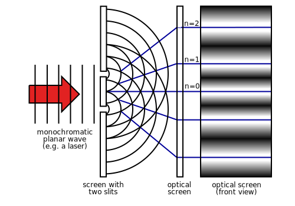
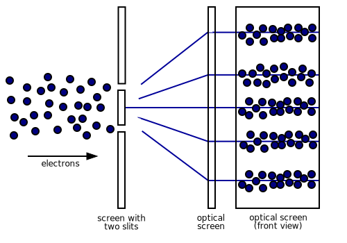

A couple of weeks ago I got out my nerd mug and had a dumb thought. My nerd mug is a
custom coffee mug that I made that has this formula on it:

$$
(\star) :: M a \rightarrow ( a \rightarrow M b) \rightarrow M b
$$

This is, of course, the famous "monad" formula, you can [read about it
here](https://homepages.inf.ed.ac.uk/wadler/papers/marktoberdorf/baastad.pdf). I like this
formula because it encapsulates the deep obsession with meta-circular recursion that we
computer programmers love to play with. Anyway, that's all I'm going to say about it for
now.

For a while I've been thinking about making a second nerd mug with a different formula on
it, this time from physics. After thinking about for a while I decided it should be
something like this:

$$
\psi M_0 = (\psi_1 + \psi_2) M_0  \rightarrow   \psi_1
M_{1} + \psi_2 M_{2}
$$

This is the formula that is at the center of the question of the _measurement problem_ in
quantum mechanics. Of course, like all short formulas that say a lot, it takes many words
to explain what it means.

### Classical Physics

To understand how quantum mechanics has puzzled people for so long we first have to go
back to the Newtonian physics that you might or might not have learned in high school or college
physics. You remember ...

$$
F = ma,
$$

all those stupid force diagrams with boxes and ramps and ropes and stuff. This formula is
the basis for what we now call _classical mechanics_. The word _mechanics_ tells you that
the formula describes _motion_, and it turns out that this formula, and more abstract
generalizations of it do a pretty good job of describing the motion of macroscopic objects
in most situations that you can put macroscopic objects into.

The generalization of Newtons formula above can be set up so you put some numbers into a
single black box, turn a crank, and every answer that you ever needed falls out the other
side. This magic box is a set of *differential equations* that describe how the system you
have described evolves in time. I am not going to go into the details of how differential
equations work, because honestly I don't know them. But, for reference they look something
like this:

$$
\frac {d {x}}{dt} = \frac{\partial H}{\partial p}, \quad 
\frac {d {p}}{dt} = \frac{\partial H}{\partial x}
$$

Here, $x$ represents position and $p$ represents momentum (momentum is
the mass of the object times its velocity ... $p = mv$. For some reason this is a more
convenient way to work than with the velocity directly). $H$ is called the *Hamiltonian*,
named after the mathematician who made it up: [William Rowan
Hamilton](https://www.youtube.com/watch?v=SZXHoWwBcDcR). It is a measure of the total
energy in the system.

Here we think of the combination of position and momentum as the current _state_ of the
system. What the formula says is that we can capture the behavior of the system in a way
that is rigorous enough to write down the Hamiltonian, then given any initial state of the
system I can tell you what the future state of the system will be by playing the math
forward. All I need is a computer and the formula.

This basic set of mathematics is how we send probes millions of miles into space and have
them hit a particular position over (say) Jupiter 5 years from now exactly when we think
they will. When combined with Maxwell's electromagnetism the whole framework does a pretty
good job explaining most of the physical phenomena that we encounter in our every day
macroscopic lives. But of course, there were exceptions, which is why quantum mechanics was
born.

### Quantum Mechanics

Quantum mechanics was originally born to describe the motion of atoms and things related
to atoms. There is a whole catalog of interesting behaviors that the Newton and
Maxwell's laws could not explain, like:

1. The appearance of spectral lines that discrete frequencies in the spectrum of an atom.

2. The interference patterns in the two slit experiment.

4. Radioactivity.

And so on.

It turns out that the way to explain these things was to model subatomic particles as
functions that determine probabilities. These are the famous _wave functions_ of quantum
mechanics.

For example, in the two slit experiment the relevant wave function maps points in space to
a "probability amplitude" that a photon or electron will occupy that point in space. We
write such a thing as $\psi(x)$ or $\psi(x,t)$ depending on whether we are keeping track
of time. These amplitudes take the form of complex numbers. We'll get to what these
amplitudes might mean in a few paragraphs.

The next piece that you need to make quantum mechanics is a rule that defines how wave
functions evolve in time. This would be similar to the classical rules for position and
velocity that we worked out above, but different. Schrödinger is famous for discovering
the right rule, so the equation for it is named after him. It looks like this:

$$
H \psi(x,t) = \frac{\partial}{\partial t}\psi(x,t)
$$

here $H$ is again the Hamiltonian, and as before is related to the total energy of the
system you are studying. The fact that this formula looks at least superficially similar
to what we had before is sort of encouraging. What ends up happening is that functions
that are solutions to this equation provide us with the apparently discrete energy levels,
or _spectra_ that are required to explain many of the strange ways that atoms behave. In
particular it can provide you with the model of the atom that you need to explain the
spectral lines.

It _feels_ sort of like this equation describes a wave-like motion just like we might see
in classical mechanics. But, we must be careful. The waves in classical mechanics are an
aggregate phenomena created by the motion of lots of things (air molecules, water
molecules, etc) at once. Even more abstract entities like electromagnetic waves still have
a sometimes visible macroscopic manifestation (let there be light!). The quantum wave
function is nothing like this. Those complex numbers that are waving around are, as we
said above, just (sort of) probabilities.

But they don't represent probability directly. Instead, to get probabilities you have to
compute something called the _norm_ of the wave function, which is a measure of its
overall magnitude ... like its length if it were a piece of string. We write the norm of
the wave function like this: $|\psi|$ or $|\psi(x,t)|$. If you know how to compute it then
the probability of finding an electron (say) at point point $x$ in space would be

$$
P(x) =  |\psi(x,t)|^2 .
$$

Computing this norm usually involves some kind of fancy integral. This interpretation of
the wave function is called the _Born Rule_, and I'm not doing to go into the particular
details of how one computes these things here. I will say though that this formula
explains the interference patterns that you get in the two slit experiment. This
computation turns up in a lot of "beginner" books on quantum mechanics, including the [one
that Feynman wrote](https://www.feynmanlectures.caltech.edu/III_01.html). So look there
for more details.

This rule feels like the luckiest in a series of lucky guesses. But it is undefeated
in terms of experimental confirmation. Every experiment that has been done in quantum
mechanics has amounted to thinking about a wave function, defining the right Hamiltonian,
and then computing probabilities with the Born Rule, and the numbers are always right.
Sometimes they are right to a ludicrous level of precision too.

### Linearity and Operators

To get from wave functions to the weird measurement formula above we have to observe a
strange fact about the nature of the solutions to the Schrödinger equation. The
Schrödinger equation is what is called a _linear_ differential equation. Linear functions
obey a simple and very convenient rule. If you have some function $f$ that maps (say) real
numbers (${\mathbb R}$) to real numbers, then given two real numbers $x$ and $y \in
{\mathbb R}$ the following will be true:

$$
f(x + y) = f(x) + f(y)
$$

and also

$$
f(ax) = a f (x)
$$

for any constant $a \in {\mathbb R}$.

So the general rule for linear functions will be:

$$
f(ax + by) = a f(x) + b f(y).
$$

Let's call this rule "(L)".

You might remember linear functions from high school algebra because when you graph them
you get a straight line, and in general you can express all linear functions from
${\mathbb R}$ to ${\mathbb R}$ with this formula, which haunts the dreams of high
schoolers everywhere:

$$
f(x) = mx + b
$$

Linear algebra generalizes the study of linear things to higher dimensions, so instead of
real numbers and simple linear functions you play with _vectors_ and linear
_transformations_ or _operators_ which usually take concrete form as matrices. I outlined
the rules for simple vector spaces in an [earlier post about
physics](reading-physics.html), and these rules haunt the dreams of college sophomores and
juniors, and programmers who write graphics code.

To return the the Schrödinger equation. Recall that it is written

$$
H \psi(x,t) = \frac{\partial}{\partial t}\psi(x,t) .
$$

Now let's rearrange this a little bit and make it easier to read by just remembering the
space and time dependence in our head:

$$
H (\psi) = \frac{\partial}{\partial t} (\psi) .
$$

What this formula says is that whatever this function $H$ is, it must behave the same as
this other function "$\partial / \partial t$" which is the "taking the first derivative"
function. But taking first derivatives is a _linear_ function (of functions). In
particular it obeys the general rule (L) that I wrote down above. So $H$ must also be
linear in the wave function.

So, if you have _two_ wave functions $\psi_1$ and $\psi_2$ and they both are solutions to
the Schrödinger equation, it must be the case that any linear combination of the two is
also the solution. That is, if $\alpha$ and $\beta$ are complex numbers then I can make a
new function like this:

$$
\psi = \alpha \psi_1 + \beta \psi_2 
$$

and $\psi$ must also be a valid solution. In other words, any linear combination of two
valid wave functions ("quantum states") is also a valid state.

This, it turns out, [*is the most important rule in all of quantum
mechanics*](https://www.youtube.com/watch?v=Ei8CFin00PY&t=2278s).

The state $\psi$ above is what is called a "superposition", and half of all the strange
things about quantum mechanics come from the behavior superposition states.

### What Happens When You Don't Look

The two slit experiment, and experiments like it that measure things like photon
polarization are an easy example to provide insight into the nature of superposition
states. I have stolen most of the interesting explanations below from Feynman, so you
should just [go read his text
instead](https://www.feynmanlectures.caltech.edu/III_01.html).

Here is a diagram of the classic two-slit interference experiment:

> 

When you do this with water waves, or light waves, the interference pattern appears
because the waves coming out of each hole are not completely in phase with one another.
So, in some places the higher parts of the waves will add together, and you get a bright
spot. In other places, the high and low parts cancel, and you get a dark spot. And so on.

In the quantum version of this experiment what you do is set up (say) an electron gun and
turn down the intensity of the source so that only one electron is actually "in" the
experiment at once. Amazingly, the interference pattern still emerges!

> 

You can even [watch a video of the screen in an experiment like
this](https://www.youtube.com/watch?v=j3Vk4Tu_uMo) and see the interference pattern
emerge. You can also [read about one version of this experiment
here](https://www.hitachi.com/rd/research/materials/quantum/doubleslit/index.html) and
[here](https://www.famaf.unc.edu.ar/~gcas/cuantica1/tonomura89-young_e-.pdf). Finally, the
above experiment does not actually use slits, but rather a different sort of
interferometer. But, people have done this experiment with [actual nano-sized slits as
well](https://aapt.scitation.org/doi/10.1119/1.2757621). The last paper is behind a
paywall ... but you should be able to find the PDF on the Internet if you try hard.

As a side note, you can also see this behavior when doing this experiment with beams of
light. Light comes in waves, but also in photons. This is the origin of the popular catch
phrase in quantum physics: "wave-particle duality" ... but you have to be careful about
taking this phrase too literally. As we mentioned above, wave functions do not live in any
sort of _physical_ space. Instead they are things that we are interpreting as telling us
about the probability of other things happening in particular areas in space, which is a
rather different thing.

Using the wave function formalism above, we can come up with a simple-minded explanation
for this interference behavior without a lot of math. Let's say that the wave function
$\psi_1(x)$ represents "the electron hit the screen at $x$ after going through slit 1" and
$\psi_2(x)$ represents "the electron hit the screen at $x$ after going through slit 2".
Then the total wave function for electrons in the experiment is just the sum (or
superposition) of $\psi_1$ and $\psi_2$. We know from linearity that this is a valid wave
function.

To compute the probability of seeing the electron
at any particular vertical position $x$ on the screen, we can reason that

$$
P(x) = |\psi_1(x) + \psi_2(x)| ^2
$$

If you expand this out here you get

$$
P(x) = |\psi_1(x)|^2 + |\psi_2(x)|^2 + 2|\psi_1(x)||\psi_2(x)| \times {\rm Phase}(\psi_1,\psi_2)
$$

Here the term ${\rm Phase}(\psi_1,\psi_2)$ is just a number between -1 and 1 that
represents the relative phase of the two wave functions. When the wave functions are
exactly out of phase, the interference term will cancel the other two probability terms.
When they are exactly in phase the total probability will be higher by a factor of 2.

This math turns out to be exactly the same math that you would use to explain [the
interference of water waves, or sound waves, or light
waves](https://en.wikipedia.org/wiki/Wave_interference). But again, I would caution
against thinking of wave functions as actual physical waves in space. These are strange
probability-generating waves that you can't really observe in isolation. Which is what we
will get to next.

### What Happens When You Look

This behavior is a bit odd in many ways, but for my purposes here I am only going to point
out two of them:

1. When we look at where any single electron _is_, it always shows up as a dot.

1. But, when we push enough electrons through the experiment over some period of time, we
   get this interference pattern that is reminiscent of what we expect to see from an
   interference experiment that we run with water waves, or light waves. We even use the
   same math to compute the intensity pattern, except in the quantum experiment we
   interpret the intensity as probability.

Finally, to make the world seem even stranger, the last thing to note is that if you
change the experiment by putting any kind of a detector between the two slits an the
screen that allows you to figure out which way the electron went, then the interference
pattern disappears. In other words, just as looking for the electron at the screen seems
to localize it to a single position, looking at which way the electron went at the slits
also seems to localize it and thus destroy the "wave-like" interference behavior that you
get when you leave it alone.

In any case, this dual behavior puts quantum mechanics in a difficult spot. It seems like
the experiment tells us that there are two sorts of evolution for quantum systems.