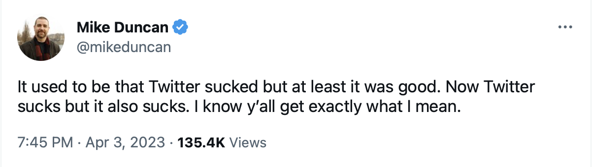

Well, [this aged well](anti-social-social-networking.html).

The last few years have been mostly down for the systems that we call "social media." Once
thought to be the pinnacle of the late-capitalist engine for consumer surveillance and
arbitrarily profitable advertising engines people _finally_ seem to having second thoughts
about using a system that records and broadcasts their every thought and action to the
entire Internet at once all to sell clicks and ads for someone else's profit. They didn't
think _too hard_ about not doing this anymore, but the thought did cross through the
collective conciousness, if only for a microsecond. Then the kid pictures continued to go
up and the "day in the life" videos continued to be posted. Ah well.

Then in a fun twist, a self-centered billionaire narcisscist dipshit asshole made a joke
about buying twitter for 44 _billion_ dollars and then it turned that, joke's on him, he
had actually made an offer that he could not back out of. And that went really well.

So now we are in a situation summed up by this message:

> </a>

This same sentiment is true for most of the major social platforms. Certainly the "big
three", Facebook, Instagram and Twitter are now mostly brands shilling brands mixed with
ads for other brands and then if you are really lucky there will be a message once in a
while written by someone you actually told the system you wanted to follow. Tiktok is also
like this, but there the difference is most of the stuff is still fun.

I am not too sad about these things. I think these systems were bad. They were a bad idea.
They were badly designed, badly architected, badly implemented, and badly managed. If in
fact we somehow manage to make them die, the world will be better without them.

Consider that the pitch for these systems is as follows:

1. Get a lot of people to sign up to provide you will all of your content _for free_.

2. When one out of every several million "creators" gets popular, give them channels to
   make "deals" with "brands" so they can get paid a pittance or maybe if they are really
   lucky find a real job in some other part of the industry where they don't have to crank
   out a few minutes of content every single day to feed the beast.

3. Convince your real customers to pay you money for ads to feed to the people while they
   scroll the free content.

4. Implement all of this with some of the worst UI ever conceived by man.

5. Wrap it in a gift box labeled "public town square" or "important intellectual
   engagement" to make people think they are doing something more than just scroll cat
   videos, sports highlights, and soft core porn.

It has always been puzzling to me that this pitch worked so well that no one can
apparently do any kind of marketing without it. How did we go so wrong?

Now I'm going to pick on twitter some more, because it's just that easy. Twitter, to me,
reached its peak sometime between 2010 and 2015 when it was good for one single thing:
watching online commentary on a live event that everyone you follow on twitter was
watching at the same time. For me this was NFL football games and sometimes the NBA
playoffs. I imagine for a lot of the rest of the world the coverage of European and World
soccer had a similar feel. For the non-sports nerds maybe it was TV shows, although no one
watches those "live" anymore.

What made this fun was:

* Fun interesting people were commenting on what you just saw.

* You could throw your dumb thoughts into the firehose and feel like someone might be
  seeing them.

That's it. That's what twitter was good for.

Twitter is bad at literally everything else. It's not a good chat system (all the threads
are upside down). It's not a good way to manage your content streams (the single timeline
makes it too easy to miss things). It's not good for posting anything longer than a text
message, and even if it was it would be a terrible place to read such things. Finally, its
implicit broadcast structure makes it too easy, in fact almost inevitable, for any random
post of yours get seen by too many of the wrong people with the result being that your
account is irreparably destroyed by spam from every single asshole on the Internet.

So yeah, twitter sucked in all ways. But at least it was good at that one thing.

But now it's not even good at that one thing. With the Chief Dipshit Officer in charge all
your journalist "friends" (or their bosses) who used to watch football with you have
finally noticed that it's not good for _them_ to be broadcasting their thoughts in this
way so that entire river of takes has dried up. So now twitter is just bad.

But you might have heard of a new kind of system named after an elephant that the nerds
have been toiling over for the last decade while everyone else mostly either ignored them
or just pointed and laughed. Yes indeed this system exists, but don't get too excited
about the hype. They did fix one or two bad things about twitter. Let's see if you can
guess which ones.

* No, the threads are still upside down.

* No, the reading interface is still terrible.

* No, it's still all timelines, so everything you might have wanted to see just gets
  washed away if you miss it.

* No, the UI for "conversations" there is still mostly the same level of painful.

* Yeah, they got rid of search, which you never once used on twitter ever.

The one thing they did do was break up the back end into a lot of separate servers run by
independent individuals. So instead of broadcasting your precious thoughts to every
asshole on the Internet everywhere, all you do now is broadcast them to _just the assholes
on server you picked to join_. To get more assholes to see it, users from the other servers
have to follow you to open up a tube to get your posts from one server to the other.

This, the nerds say, will fix everything, and create a system that can truly fulfill the
_great potential_ for ... something ... that systems like ... checks notes ... twitter ... could
have reached.

I'm here to say that this is not true. The best case for these systems is the following:

* A bit less of the asshole wave from twitter. But if your account is popular, not that
  much less.

* None of the fun things, because the big media platforms have realized that social media
  is a dead end, and social media with deliberately limited audience reach is even more of
  a dead end.

So, no more watching TV with the whole Internet for you. Instead all that they have built
is, best case, a local chat room with one of the worst interfaces for a chat room that you
can possibly imagine building.

Here is the thing. And please believe me when I say I am 100% serious about this take:

* USENET was the first federated social network. And it was mostly better than what we
  have now.

That's really all you need to know about this.

The most amazing thing about USENET is that even with only ASCII terminals to work with
the news _reading_ interface _is still better_ than every Internet forum and shared media
site that I have ever used. If you think about what devices then could do (ASCII _only_)
versus what a phone can do now, the fact that 40 years later everything is _still_ worse
is a pretty damning condemnation of the intellectual capacity of the human race.

Anyway. My only deep thought about why social media systems suck is essentially the same
thought as in my original piece. You can't talk to the whole Internet at once and have a
good time. It's just not possible. So whatever interface we build for this is going to
have to be cut up into smaller pieces organized by common interest, much like the old
Internet Forums and USENET newsgroups (and these days, slack servers, and discords run by
brands). Yes yes, this is what "federation" does, in theory. But again:

* This is the most obvious fact in the entire world.

* A single instance, set up just like you want, to mostly read what other people say
  without replying.

It remains to be seen if humanity can come up with a better way to interact with itself
online. Obviously I am skeptical that it can be done. But I'm not the one to build it for
anyway. I post words on the Internet that you can't even write comments on, because
comments are stupid.
