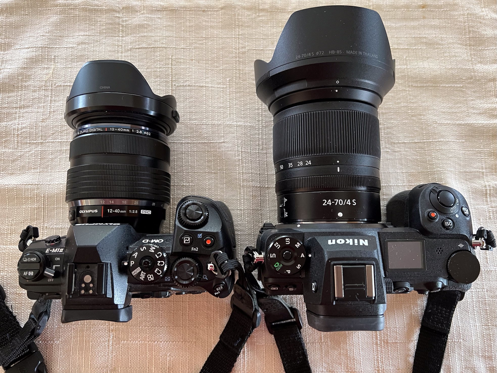
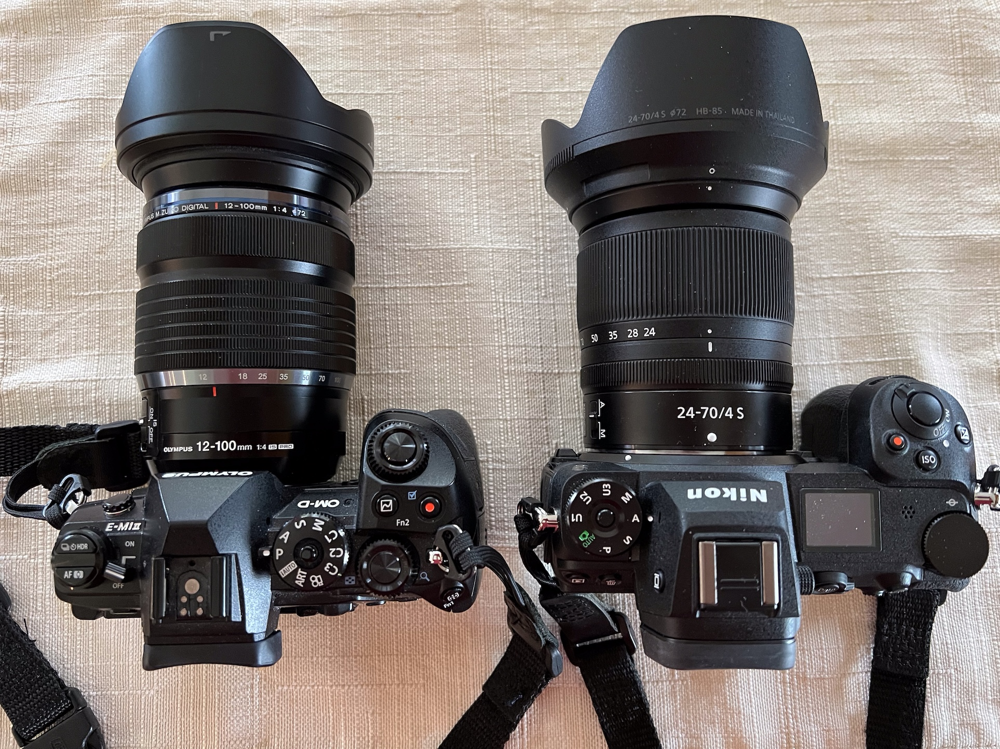
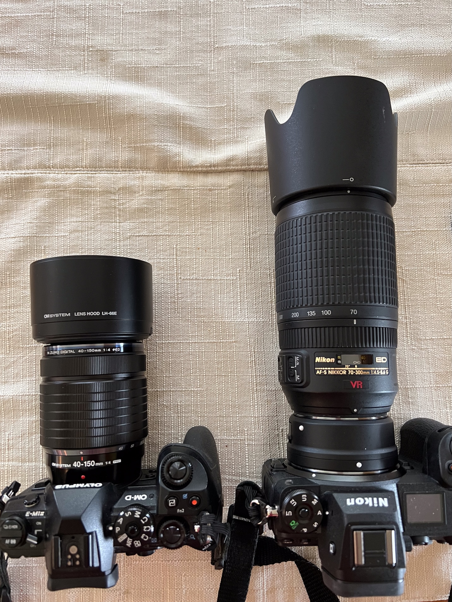
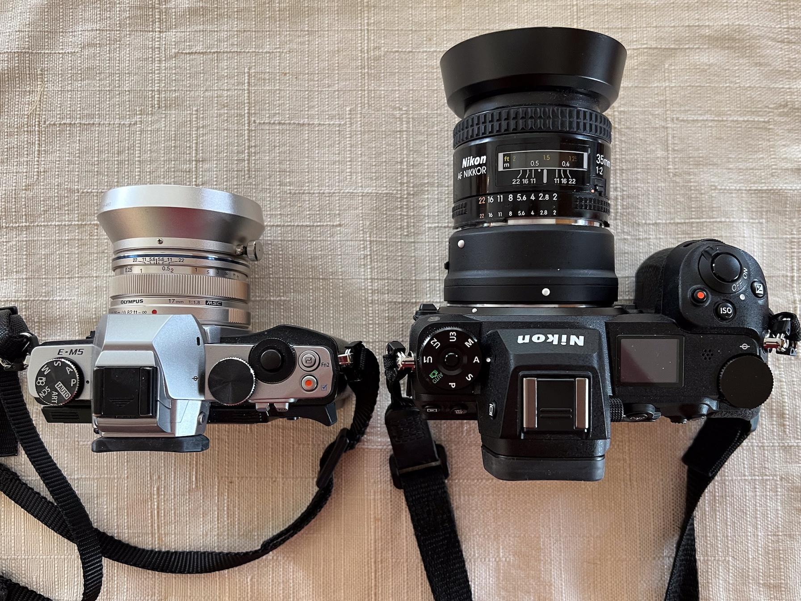
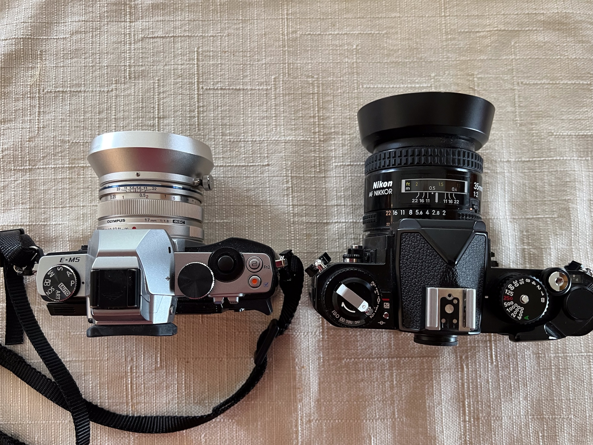

I am apparently in a relatively small minority of camera users that use a camera besides
my phone for taking pictures. I do this a lot less than I used to, because the phones have
gotten really good. But I still do it.

Most of my time with non-phone digital cameras has been spent using either Nikon DSLRs,
which were mostly great, but always too big. And Olympus (now "OM System", but I'll still
use the old brand name) mirrorless cameras, which were great once you went through the
pain of setting up the four modes you want to use them in, and also deliciously small by
comparison to the Nikons.

Then Nikon got into the mirrorless game, making cameras almost as small as the Olympus,
and generally about as great as the DSLRs. At this point I figured my time with Olympus
was over, esp. since the Olympus company sold their camera business to some nameless
private equity firm which brought the brand back as "OM System", which is piece of
branding no one can love. I concluded that given that Nikon was still making new things,
and since "OM System" was maybe not, eventually I'd be getting back into the Nikon stuff
anyway. So I jumped back in.

The Nikon Z6II is a mirrorless camera body that feels exactly like a Nikon DSLR to use
(which in turn felt exactly like a classic Nikon autofocus film body to use, only better).
It can really do anything you want. And it unquestionably does two things much better than
the Olympus body that I had been using the last 5 or 6 years:

- The noise and sharpness in low light is a lot better.
- The autofocus system is a lot easier to control.

The tracking AF is what sold me. I don't actually shoot a lot of moving things, but the
convenience of being able to put the focus box on a thing, hit the focus button and then
recompose however I want while the camera just stays locked on to the focus spot was just
great. In most situations this gets you results that are identical to what you used to get
by locking focus and recomposing. But if the thing in the box moved around at all, the
camera would generally hold on to focus like magic. I loved this every time I used it.

So I spent a few months happily taking the Nikon and the kit lens (an emminently practical
24-70mm F4 zoom lens) around and plugging away with the focus box. Then I put the camera
in a box and barely used it.

Then I started thinking about expanding the lens line. I generally want three zoom lenses
to carry around, even though I usually only use two of them. I like zoom lenses. They are
convenient and at this point in my life I am too old and lazy for the hassle of constantly
changing single focal length lenses around.

- Very wide to wide.
- Wide to normal.
- Long.

Most of the major camera lines have these lenses. But I hesitated getting the Nikon wide
zoom and long zoom. To explain my hesitation, I need to explain some boring technical
things.

When camera nerds talk about lenses they tend to refer to the lenses in terms of their
focal length. The focal length of the lens is nominally the distance from where the light
enters the lens to where it hits the capture plane (the sensor, say). Shorter focal
lengths have wider fields of view. Longer ones have small fields of view.

The Nikon Z6II has a sensor in it that is the same size as a piece of 35mm film from the
old days, so we can use the standard focal length terminology from those days. So the
range of focal lengths for the three zooms listed above would be

- Very wide to wide: 14-16mm to 24-35mm
- Wide to midrange telephoto: 24-70mm. Or if you are being adventurous 24-120mm.
- Long: 70-200mm or 70-300mm.

The Olympus cameras that I use have a sensor that is smaller than a piece of 35mm film. In
fact, it is strategically set up so that if you double the actual focal length of the lens
you are using, the field of view you get will be about the same as that doubled focal
length would have when using a 35mm camera. This rule is harder to explain than to say
with an example: A 12mm lens becomes 24mm, 50mm becomes 100mm, etc.

This means that the three lenses I want above are something like this:

- Very wide: 7-14mm or 8-25mm.
- Wide to Midrange: 12-40mm or 12-100mm.
- Long: 40-150mm.

Because the "real" focal lengths of the lenses are shorter than what you would build for a
35mm camera, the lenses themselves are inherently smaller for the same range of field of
view. But, the lenses also have to cover a smaller chip area with a nice image, which also
lets you make them a lot smaller by volume.

So, even though the Nikon mirrorless _body_ is in fact a lot smaller than the old DSLRs,
the _lenses_ you put on them are basically the same size. And the _lenses_ become the
limiting factor in size, weight, and volume when carrying the camera around.

If you compare the size of camera+lens for the two systems your universal conclusion is
that the Nikon lenses are longer, fatter, and heavier than the Olympus lenses of similar
focal lengths.

Here is each camera with a midrange zoom attached:

> > 

Here the Nikon has the same zoom as before, the the Olympus has a zoom lens with twice the
reach. The total Olympus package is still a lot smaller because the width of the camera
body and the diameter of the lens is so much smaller.

> > 

Here is each camera wearing the telephoto zoom I'd use on them. The Nikon lens is
a 70-300mm F4.5/5.6, and the Olympus lens is a 40-150 (80-300mm equivalent) constant F4.

> > 

The Olympus zoom expands a bit when you actually use it, but is still less than half the
size and much lighter. And it's a stop faster at the long end to boot.

**Unrelated related note:**  I also have the 40-150 F2.8 Olympus lens, which is an
incredible lens. Even at two stops faster on the long end it's still a bit smaller than
the Nikon. It also has a bad retracting lens hood design that caused me to smash the
filter ring on it a couple of years ago and I could not figure out how to get it fixed.
This might have made me mad enough to try the Nikon stuff at the time, or it might be
completely unrelated. I'm not sure.

At this point the reply-guys in the audience are telling me that real men shoot with prime
(single focal length) lenses, and surely you can find a small Nikon body/lens combination
there to make you happy to which I say ... remember how small the _Olympus_ primes are?
You can't win there either.

Here is a Nikon 35mm prime on the Z6 (with an adapter, because I don't have the Z lens,
which is a lot bigger than this one). The Olympus E-M5 body is smaller than my other
Olympus, but is the one I would use with this lens because the colors match.

> > 

Here is the same lens on a Nikon FM3a film body, which is smaller than any Z body made a
much more nostalgic besides.

> > 

Of course, size isn't everything. In theory you give up a lot going to a smaller sensor,
especially in terms of sharpness and noise performance in bad light. In addition, Nikon,
for all its faults, is pretty good at building autofocus systems and reasonably
straightforward interfaces to run them. The tracking focus system that I described above
is great. Olympus has never really been able to keep up. And, there is the overwhelming
possibility that by the time I post this page, "OM System" will announce that it is
disappearing into the trash bin of camera brand history.

And yet I dithered. I spent almost two years using the Nikon, and never felt like I wanted
to keep going with it. It turned out to be because if you more carefully examine the
technical advantages that the Nikon allegedly has you can kind of tell they are just the
kinds of ghosts that nerds like me chase to spend money.

Yes, the autofocus is great. But, I am _really bad_ at actually taking advantage of the
the things that it is great at. Shooting good in-focus pictures of things that are in
motion is a skill that is _not_ easy to learn and certainly not easy to _keep_ if you
don't practice a lot. I mostly shoot pictures of stuff that is either standing still or is
close to it. So I never practice that stuff. So even if the camera were _perfect_ I'd
still fuck everything up because the framing, or the timing, or something else would be
wrong.

Also yes, the bigger sensor is better. Especially in low light. But honestly I take most
bad light pictures with my phone now. It's easier.

So in the end it turned out that size actually _is_ everything. The Nikon Z lenses are,
simply put, really large. Even the prime lenses are big. And the wide/tele zoom lenses
that I would have wanted to get are super large. I knew I would want to use them. But I
also knew I would never want to carry them. So for almost two years I sat around
paralyzed. I really liked the camera, but could not get myself to buy the lenses.

And finally, to end the story ... during this time that I was dithering Olympus, sorry "OM
Systems" released not only a new body that is a bit better at the things my current body
is bad at, but also a set of newer and even more deliciously small lenses: the
small telephoto in the third comparison photo above, and a really useful super wide to
normal 8-25mm (16-50mm equiv) zoom. So I picked up the lenses on sale, and will keep them
in my bag for those situations where the 12-100mm won't do the job.

Inevitably I'll probably pick up the new OM body, even though it's not _that_ much better
at this stuff, and the UI is still a trash fire. Hopefully "OM systems" keeps its head
above water for as long as I need them to. Or at least long enough to sell me the one body
that I'll use until Apple figures out how to fold a 200mm lens into an iPhone. At that
point I'll well and truly give up on carrying cameras around for good.
