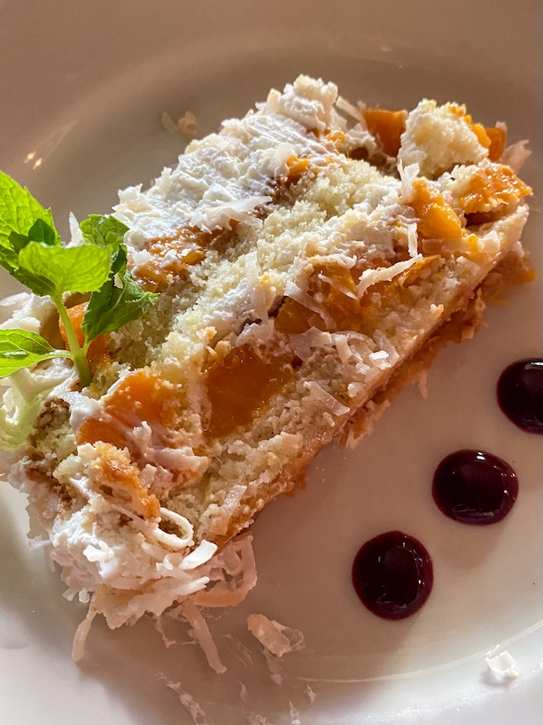
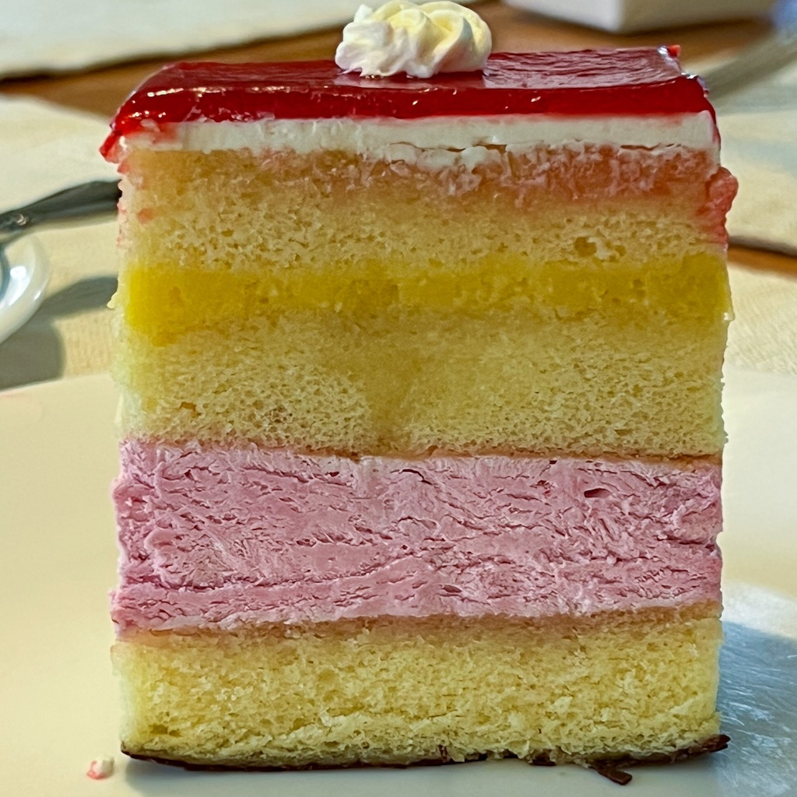
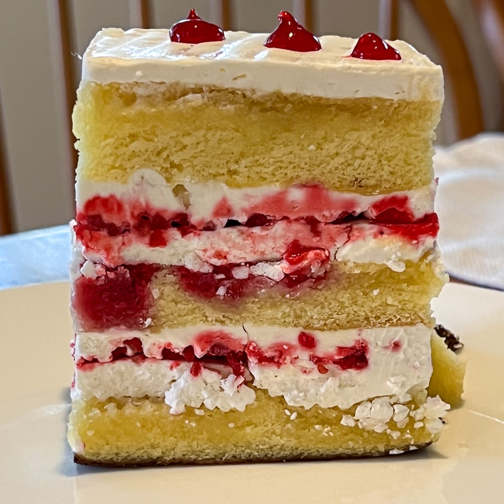
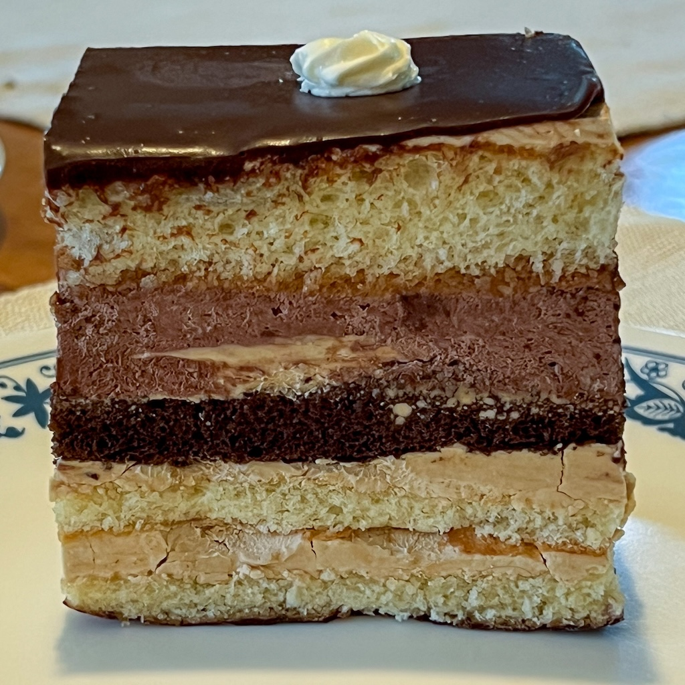
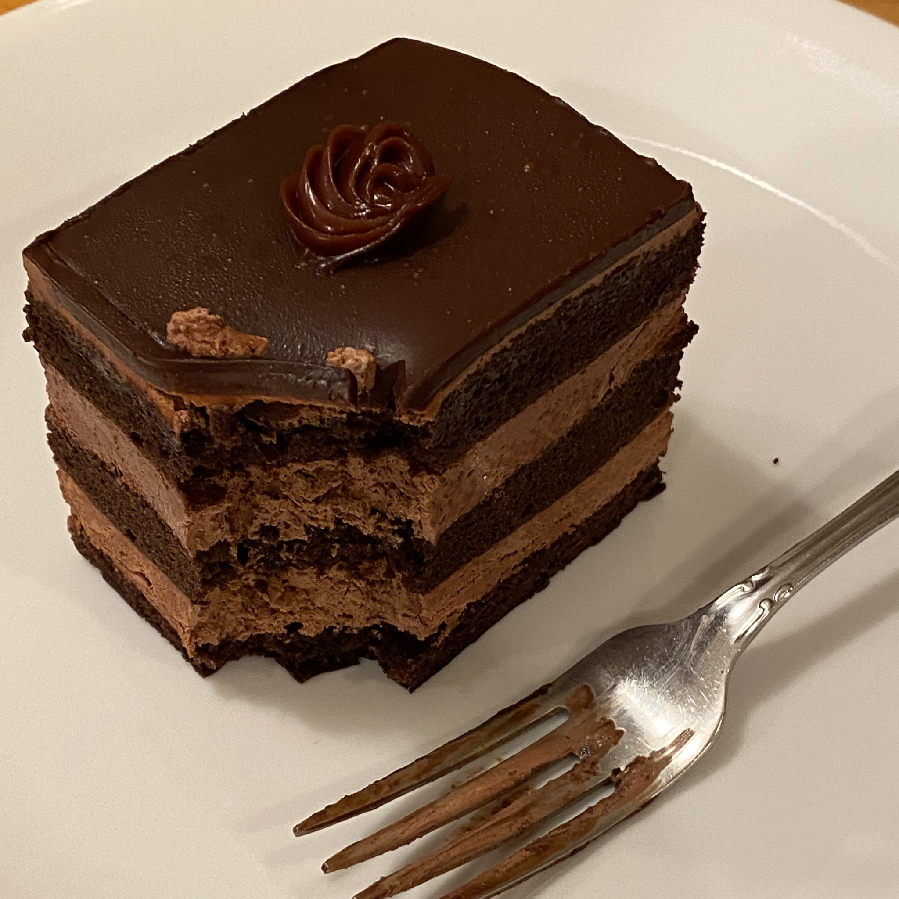

We were at <a href="./dish.html">DISH</a> the other night and they had their Mango Cake on
the menu. This is a light layer cake with little pieces of mango and cream between the
layers. And then more cream on top. This cake is so astounding that I don't even mind the
dried shaved coconut they put on top. And I usually hate that shit.

I have pictures of this cake going back to my earliest use of digital cameras for
anything.

Here it is:

> 

This cake got me thinking about one of the strange food puzzles in Pittsburgh. The
strangest food puzzle in Pittsburgh is, of course, the fact that there is _no_ hot Italian
sausage in Pittsburgh that is better than the Giant Eagle store brand Italian sausage.
Which makes no sense whatsoever.

However, next on the list is the fact that there are so few places in town that know how
to make cake. Most of the cakes in town fail across at least one of the following
dimensions of quality:

1. Cake too dry. Good cake should have a nice moist feel to it. This is not a cracker
   pastry or some shit. It's cake.

1. Cake too heavy (or chewy). A slice of cake should not weigh a pound, or be eight inches high.

1. Frosting is all sugar. The only proper icing for a cake is some kind of whipped cream
   or fancy butter cream. Most icings that people call "butter cream" in Pittsburgh are
   really just creamed sugar that will melt your teeth from two blocks away.

1. All topping, no cake. This is more of a problem with cupcakes than cakes. But you do
   see a lot of cakes in town that are also all decoration and frosting, with not enough
   cake inside.

Anyway, here are a few places that _do_ know what they are doing.

#### DISH, Mango Cake

I mean, c'mon. Just go.

#### Chicken Latino, Trés Leches Cake

The Trés Leches cake at Chicken Latino is a reason to stay alive. All this, and <a
href="https://www.flickr.com/photos/79904144@N00/50071740991/in/photostream">Lomo Saltado</a>
too.

#### Jean-Marc Chatellier's Bakery

In addition to the best plain and chocolate croissant in town (still!) Chatellier makes
sheet cakes that he will sell you single pieces from. The main flavors are Lemon/Raspberry
(the best), Strawberry, Opera Cake, and one that's all chocolate. Here are the first
three.

> 

Oh and here is the chocolate cake with a bite taken out of it.

> 

#### Butterjoint, Chocolate Truffle Cake

The thing here is the flourless chocolate truffle cake. Let it be known that I think
flourless chocolate cake is _bullshit_. You can't make good cake without flour. But this
is the best chocolate cake in the city. So there you go. No picture of this one.

#### Girasole, Lemon Cake

Girasole makes this lemon cake with whipped cream icing that's really good.

#### Mango Mango, Crepe Cakes

These are not really cake. But they are still better cake than most in town. Lots of
cream. Nice soft pastry. The place has other things that are more cake-like.

#### Madeleine, Regent Square

The little bouchon are not really cake. But they _are_ better than cake. These folks also
do some small pastry sized cakes that are really good.

#### La Gourmandine, Brioche Bostok

The Brioche Bostok here is more of a cakey bread than actual cake. But it's fantastic and
you should get it. I have not tried any of their actual cake, but I should. And I would,
except whenever I walk in the brioche and the chouquettes are sitting right there and what
can I do?

#### Salem's

Salem's has a dessert cooler with a few different kinds of sheet cake in it. I can vouch
for the strawberry and the chocolate. We also saw exactly the same chocolate cake at the
last fish fry we went to this year at a church in Wexford. Maybe they got it from Salem's.
Maybe both places are getting it from somewhere else. Who knows?

#### Giant Eagle

Do not sleep on the sheet cake at Giant Eagle. It's better than 75% to 80% of the cake
sold at any given bakery in town.

#### Moio's, Monroeville

I haven't had a cake from here in more than ten years. But it used to be good.

OK that's it. 
