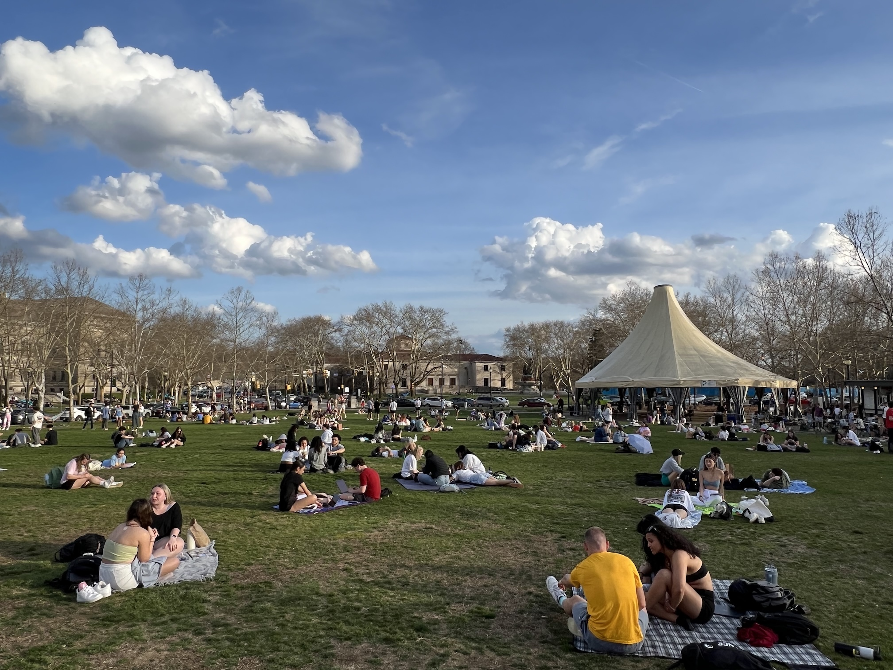

It was about 75 degrees fahrenheit in Pittsburgh today, which means it was time to go to
Dave and Andy's to get dinner.

Dave and Andy's is a venerable ice cream store on the campus of the University of
Pittsburgh. They opened sometime in the mid 80s when I was an undergraduate at nearby
Carnegie Mellon and so it was a fixture of the hot days in the summer. We'd venture down
when it cooled off a bit in the evening, after doing our summer work study jobs, and get a
(then) new fangled waffle cone and ice cream with m&m's, or reeses cups smashed into it.
They made heavy creamy ice cream, often with fruit that they got on discount from the
Strip district. It was great.

At some point after moving back to Pittsurgh we made an informal tradition of getting to
Dave and Andy's as early in the spring as possible. Eventually the rule became this: the
first day it was warm enough to _walk_ from CMU to Dave and Andy's in short sleeves with
no jacket, we would get Dave and Andy's for dinner. And sometimes a hot dog at the O (RIP)
for "dessert."

We've kept this up at least since the early years of the 21st century. And so tonight we
went again.

> 

> 

Then we got some <a
href="https://www.pennsylvasia.com/2022/10/newish-food-truck-in-oakland-hundred.html">Chinese
savory grilled crepes (jian bing)</a> for dessert.
