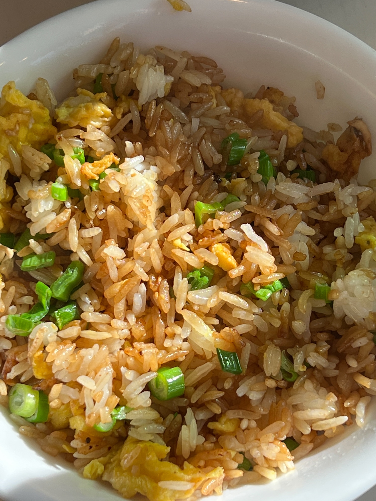
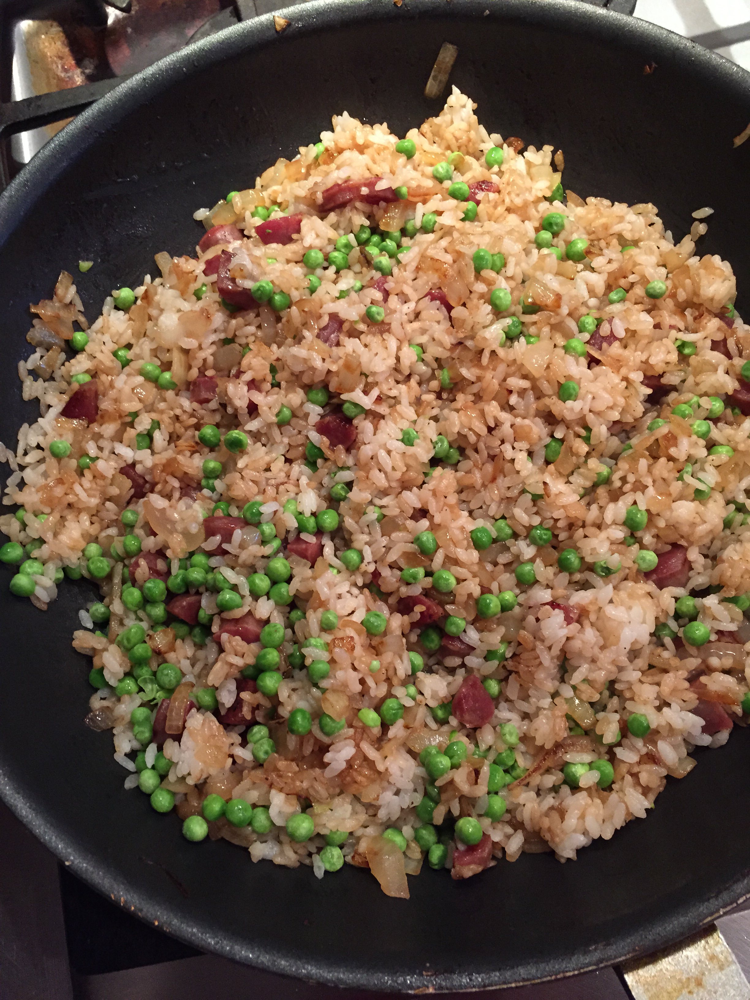
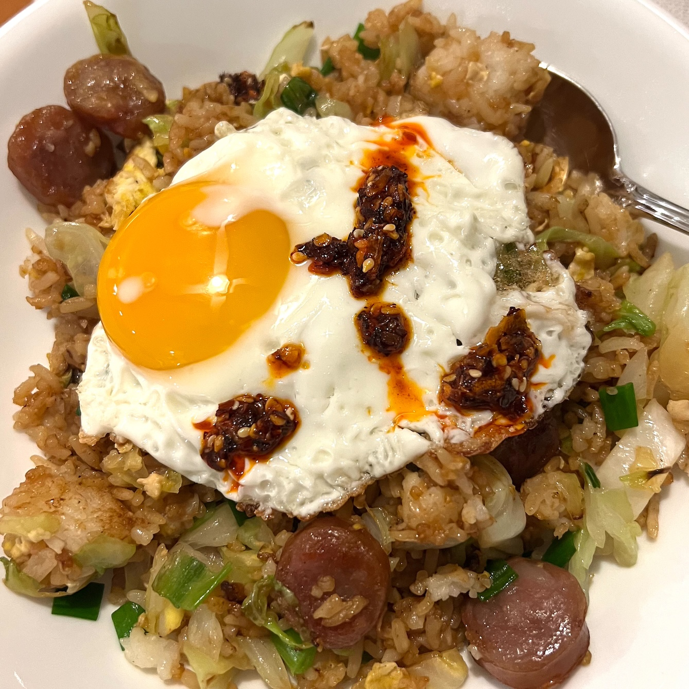
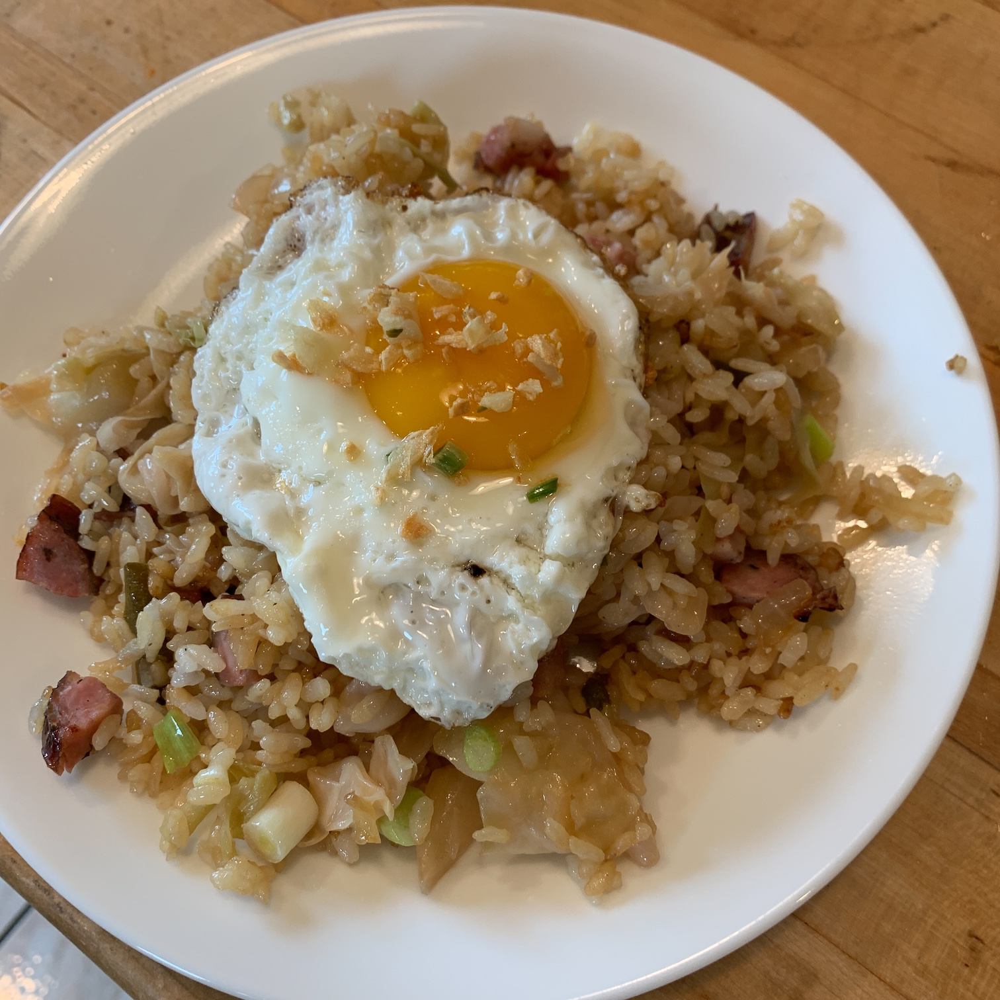

A few years ago [at "peak pandemic"](pandemic-shorts-3.html) I wrote a short blurb about
fried rice where, among other things, I praised the tireless work that [Uncle
Roger](https://www.youtube.com/c/mrnigelng/videos) had been doing to [defend this staple of
East/South Asian cuisine](https://www.npr.org/2022/04/18/1092822251/uncle-roger-keep-screwing-up-egg-fried-rice) against a seemingly never-ending onslaught of stupidity,
overthinking and general cluenessness.

Sadly, his work has not been enough. Even now in 2023 we who love this dish are still
under a constant barrage of bad fried rice recipes. So I felt I had to act. Here I will
repeat my [long standing](fried-rice.html) simple fried rice recipe, but with a few
refinements to reflect the added insight about the dish that I have gained since I wrote that
down more than 15 years ago. In addition I'll provide some reference links to other places
to look for good fried rice advice. With all of this material in hand you can now safely
ignore any new suggestions for how to make fried rice coming from the mainstream food
media of the damned (New York Times, Bon Appetit, etc) and just bookmark this page
instead.

#### The Big Picture

Fried rice is easy. Don't overthink it. Almost every fried rice recipe
that is posted on the internet is 

- Too complicated.
- Uses too many different ingredients of different types.
- Uses too much of each one.

You do not have a gigantic 16 inch restaurant wok sitting on top of a rocket engine. You
have (maybe) a 12 inch skillet or (if you have been listening to me) a 12 inch non-stick
wok. Maybe you have a 14 inch wok. Great for you. They still tell you to put too much
shit in that pan. This means

* You can't move the food around without it falling out of the pan.
* The food does not cook.
* The food does not mix into a pleasureable arrangement of flavors, because you can't mix
   it, because it keeps falling out of the pan.

A recent recipe in the NYT told you to pile _all_ of the following material into your poor
12 inch skillet:

* 1 _entire pound_ of ground meat.
* 4 cups of cooked rice.
* 2 eggs.
* Frozen peas, maybe?
* Something else I forgot.

And this is for "four servings". NYT servings are _huge_.

Anyway, you are now doomed. It doesn't matter what else you do. You will have a mess.

So, on this page we are doing to start with the easiest recipe, with a volume of food that
is manageable. Then I'll tell you some cool variations, including one of the best fried
rices ever that was published in the New York Times, of all places, more than 10 years
ago. They have this recipe in the bag and still trot out all kinds of terrible bullshit
anyway. I don't get it. Anyway, here we go.

#### Simple Fried Rice

In its simplest form all you need for fried rice is this:

1. Some day old cooked white rice. Let's say about 3 cups. Short or medium grain is best.
   Jasmine can work. If you are thinking about brown rice just stop reading and go away now.
2. An egg or two.
3. Some kind of onion/garlic/ginger or other aromatic. Let's say we have 3 or 4 scallions.
4. Salt, a little soy sauce, white pepper, MSG if you want to get fancy and dark soy sauce if you really
   want to get fancy.

Here is what you do.

First, dice the scallion into little pieces and put them in a bowl. If you are using
garlic and ginger, mince that stuff too.

Second, heat your pan on medium-high heat. When it's hot, add a teaspoon or two of oil (or
if you want to live large, use lard) and crack the two eggs into the pan. Stir them around
until they are 1/2 cooked.

Now add your onion/ginger/garlic. Mix.

Now add your rice and break it up into little pieces and mix it up with everything else.
Work really hard at this, you don't want any big lumps of rice, but rather all separate
kernels.

When the rice is good and broken up add salt to taste, a few sprinkles of white pepper and
the MSG if you have it. Then toss a 1/2 to 1 teaspoon of soy around the side of the pan
and mix that in. If you have dark soy add a tiny bit to get a deeper brown color.

Mix mix mix mix mix until it looks like fried rice. 

You are done.

It will look like this

> > 

#### Variations that You Will Love

OK. The first variation is to add meat. Whatever you pick, you don't need much. 3 or 4oz
is usually enough. If you want something really meaty, you could go up to 6oz or maybe
half a pound. You can add a lot of different kinds of meat:

- Ground pork/beef/lamb/whatever. If you hate yourself go all out with ground
  chicken/turkey. I'd rather not.
- Bacon.
- Hot Italian sausage.
- Chorizo.
- That sweet Chinese/Taiwanese cured sausage.
- Kielbasa or other European cured sausage.
- Hot dogs.

The game here is always the same. First fry/saute/brown off the meat so it's completely
cooked. Put it into a bowl. Then do the same thing as we did above, and at some point mix
in the meat.

Next, do everything we just did. But at the end mix in frozen peas (maybe even peas and
carrots). Classic Chinese American staple:

> > 

Next, we can do more interesting vegetables than just the scallions above. Shred up any sort
of green veg. that cooks fast:

- Cabbage
- Chinese cabbage
- Leeks
- Bok choy
- Whatever

When the vegetable is done, do the whole egg fried rice thing above just piling everything
on top of it. It will be great. Here we have put all these ideas together for Chinese
sausage and cabbage fried rice, with a fried egg on top and chili crisp:

> > 

Here is another example with kielbasa and cabbage in it:

> > 

And now you might be wondering about the egg on top with the crispy nuggets of something.

This is one of my favorite versions which comes from Mark Bittman at the NYT, via the Jean
George restaurant in NYC. That a French person has one of the best fried rice recipes in
the world is certainly ... something.

Anyway, you can read [the recipe here](https://archive.ph/1mOVy). Basically you take the
minced ginger and garlic and brown them in a small pan until crispy. Then you do the fried
rice above, but without the egg, and with leeks as the main vegetable. Then you assemble
it by putting a fried egg and the crispy garlic on top. Fry the eggs in the oil you used
to brown the garlic and ginger. Stupendous.

Bittman made a good video about it too. [Watch that
here](https://www.youtube.com/watch?v=i2zMrOclu-o).

There are a few more fancy techniques for incorporating eggs into fried rice that I have
not one over here, but the references below will show you how to do that. Especially Chef
Wang. Go to town and have some fun.

#### References

For more fried rice insight start at these places:

* [Bittman's fried rice from above](https://www.youtube.com/watch?v=i2zMrOclu-o).

* [Chef Wang](https://www.youtube.com/watch?v=hgYXRuQcniw). His channel has 4 or 5 great
  videos on this subject, including one on the [fanciest most expensive fried rice
  ever](https://www.youtube.com/watch?v=ZgdCMwDLhq0). The egg strand technique in that
  video is incredible. I wish I could do it, but I'm too lazy.
  
* [Uncle Roger likes Chef Wang](https://www.youtube.com/watch?v=5M_Z0ARqol8).

* Finally, the [Chinese Cooking Demystified](https://www.youtube.com/watch?v=n10xBmqehik)
  people have their own insights, including how to make fried rice without [waiting for the
 rice to sit overnight](https://www.youtube.com/watch?v=owUiKyx4chI). Watch their stuff too.
