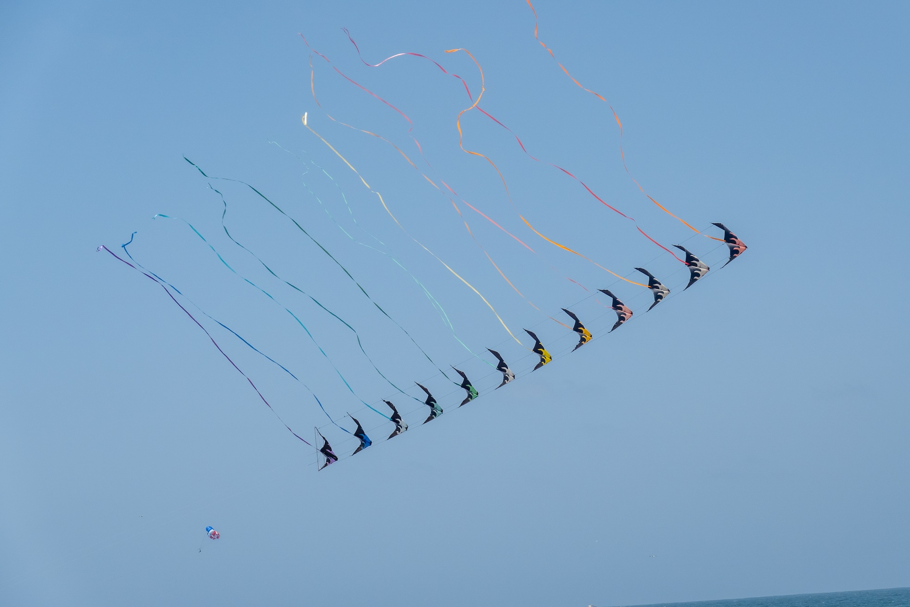
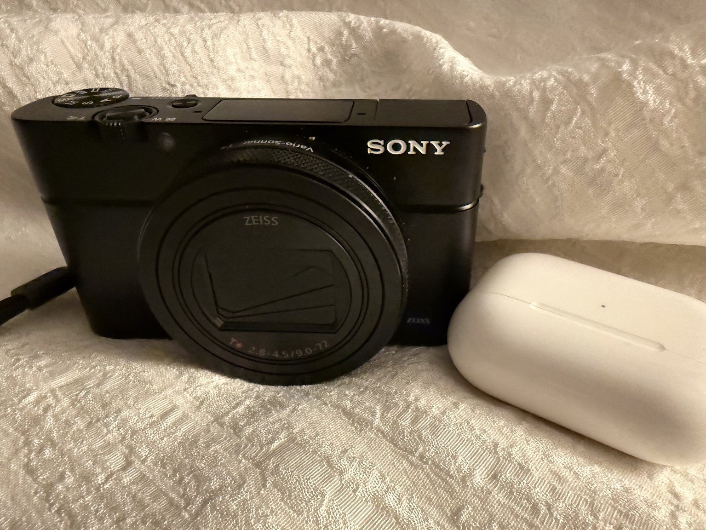

For most of my camera life I have comfortably ignored cameras made by Sony.

Sony never made film cameras, so in that world there was nothing to ignore.

Sony made mostly forgettable digital point and shoot cameras that some are irrationally
attached to because they used floppy disks for stoage. Imagine digital photos small enough
to fit on a 3.5 inch floppy disk.

Sony also made the now completely and deservedly forgotten "memory stick" storage device when
everyone else was playing in compact flash cards. This was also a reason to never use Sony
cameras.

In the early 2000s Sony bought the corpse of Minolta so that it could play in the
interchangeable lens digital SLR camera market. Minolta was a long time third place
wanabee player next to Canon and Nikon in big SLR cameras. So no one paid attention to
this move either.

But then Sony finally got their big break. Around the start of the 2010s the camera people
finally figured out that digital cameras don't need to have a flappy mirror inside them
since you can use the _sensor_ to run the viewfinder and do all the camera things and also
capture photos. Over the next ten or fifteen years Sony then iterated through literally
multiple dozens of similarly named bodies until they figured out all the engineering
necessary to replicate all of the important features of the Nikon and Canon behemoths.

- Good autofocus with automatic tracking of things that move.
- Good viewfinders.
- High quality high resolution sensors (Sony actually made a lot of the sensors that the
  other camera companies used in their bodies anyway, so this was not a stretch).
- Small size.
- Lots of lenses.
- Video (note: I never use video).

And so on.

These days all of the digital cameras we use are mirrorless. There are a few people
holding out who insist that digital viewfinders are just unusable, but most of those
people are also shooting film anyway, and can be ignored.

Anyway, during this development period Sony prototyped and packaged these features in
dozens of different camera models, all sort of the same name but slightly different. Here
is a list of Sony model names from just _one_ of their sub-categories of cameras:

- Sony A7
- Sony A7 II
- Sony A7 III
- Sony A7 IV
- Sony A7R
- Sony A7R II
- Sony A7R IIIA
- Sony A7R IVA
- Sony A7S
- Sony A7S II
- Sony A7S III
- Sony A7C
- Sony A7CR
- Sony A7CII
- Sony A7CRII

Since I could never make heads or tails of which Sony cameras did what things. I continued
to ignore them.

Then I couple of years ago I realized I was really tired of carrying my relatively beloved
but also relatively large  Olympus (now OMD) cameras around and never using. Over time
things evolved so that 75% of the time the iPhone was a more effective tool to get the
picture I wanted even if the final digital file was a bit marginal. What I found most
annoying about the OMD bodies was that they were expensive and large, and to make up for
it their basic functionality (focus, exposure, etc) had not improved since the mid 2010s.
The focus performance was particularly useless. The only focus mode that really worked was
single frame, center sensor only. So if the thing you were taking a picture of moved at
the wrong time you were fucked.

My short time with the one Nikon mirrorless camera that I bought made me realize that the
_right_ way to do this was to lock focus in _continuous_ mode and have the camera make
sure it stuck. All of the modern Nikon, Canon and Sony cameras work this way. But not OMD.

So I looked around for smaller fixed lens camera that had a focus system that worked like
this. To my chagrin there was really only one that is also available at a reasonable
price, and it was made by Sony. It has the most Sony-style name: RX100 Mark VII.

I held my nose and bought it and took it with my on some trips instead of the Olympus
cameras.

It focused better than the OM-1 Mark 2 thing that I had bought for a lot of money when I
ditched the Nikons. In particular it could do tracking focus that the OMD camera only
dreamed about.

Like these kites:

> 

The two main limitations of the Sony vs. a "real" camera are:

1. The lens is a bit slow and short. But it covers the range I use the most (roughly
   24-200mm equivalent for a 35mm camera).

2. The small sensor is a bit limited in low light.

I have not found these two issues to really limit me in any material way. A tiny sensor
camera in 2025 is about as good as a big sensor camera (or at least the 4/3rds that I had
been using) in 2015, which had always been mostly good enough for most of what I do.

Plus, the thing is barely bigger than a pair of Apple Airpods:

> 

It's hard to argue with that.

Now my photo trip outfit can be my phone in one pocket and this camera and the airpods in
the smallest of shoulder bags. This combination will do as much or more than all the kits
I have ever brought anywhere that did not include a 300mm or longer telephoto lens. Which
would be most of them.

I have taken three or four with this camera, and taken a lot of pictures like this one:

> 

After the second or third trip I started to off most of my Olympus/OMD stuff and
forget about it forever.

But, I _am_ an incurable camera dork. So I also went out and decoded enough of the rest of
the Sony camera catalog to buy the one interchangeable lens mirrorless body to cover the
few situations that the small camera won't deal with. And that camera is a Sony Alpha
A6700, their current cropped sensor body. This sensor is big enough to not have any of the
small sensor issues. So it can take the five low light concert shots I might use it to
take in the next ten years:

> 

Also, it can take all the wider lenses I don't use that much and the longer lenses that I
might want put on to it the next time I go see an eclipse. And it has the same great focus
system as the point and shoot, and it's probably better but I can't really tell. Oh, and
it takes plain jain normal SD cards too. Win win.

So I guess I have to apologize to Sony. It took them a few dozen tries, but they finally
got it right. I might continue to give occasional wistful looks at the Nikon Z5 or Z50, but
probably not. These two cameras pretty much work the way I want things to work, and the
main rule for cameras is to never change anything once you figure that out.

Good job.