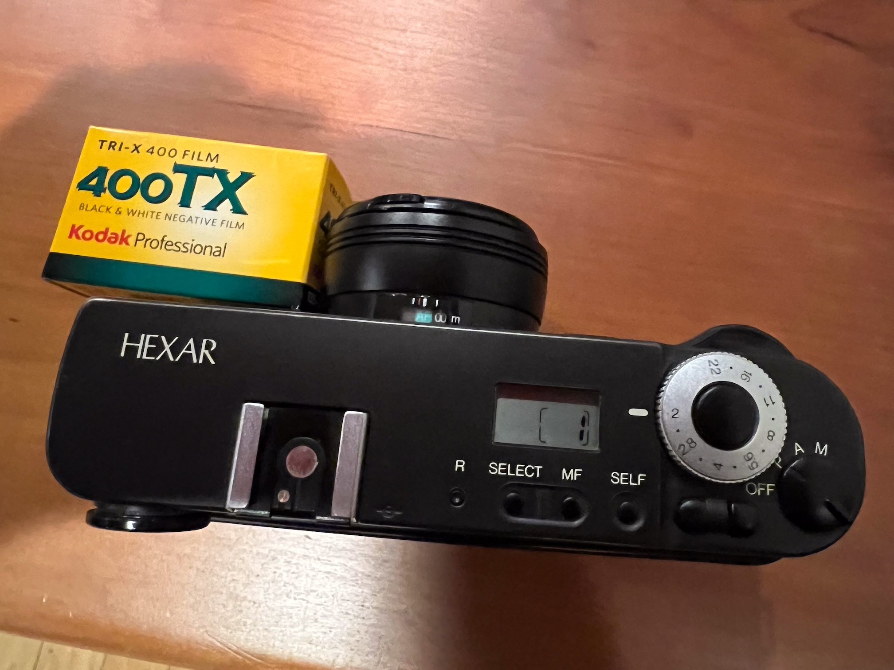

The [Konica Hexar](https://en.wikipedia.org/wiki/Konica_Hexar) was a fixed lens
rangefinder style 35mm film camera that was manufactured for sale between around 1993 and
probably 1999 to 2000. It had a Leica-ish shell but with more automated internals, and the
lens was fixed in place. That lens though, a 35mm F2, was exactly what you would use on a
Leica M most of the time. And like the Leica the Hexar had a giant beautiful bright
optical viewfinder on the left side of the camera. Unlike the Leica it had autofocus,
auto-exposure, auto-wind, and you didn't have to take the fucking bottom of the camera off
to load it with film.

I bought a Hexar at the peak of my pretentious "Tri-X 35mm black and white film shot at
ISO 320 for better shadow detail pseudo-artistic" phase. It's always been one of my favorite
cameras.

One reason I bought the camera was a very expansive review that was written by one Richard
Caruana and published at [photo.net](https://www.photo.net). That web site was one of the
most active forums for photo nerds during the Internet 1.0 period. The review was so good
that you could use it as a quick start manual for the camera when you bought it.

I had reason recently to try and look for the old review, but I could not find it at
[photo.net](https://www.photo.net] anymore. Sad. Luckily
[archive.org](https://web.archive.org/web/20100327082815/http://www.photo.net/photo/hexar)
had a snapshot of it. Still, that's not the ideal way to read the page.

Happily, it turns out that I spent some time working in the same lab as Richard Caruana.
So when I could not find the text on the live Internet anymore I asked him if I could put
it here. What follows is the original review, reformatted to look more like my web site.
All of the text is by Rich. All of the new typos are by me.

There are also some extra notes at the end of the review about what has happened to these
cameras since the 1990s.

### Konica Hexar

Review by Richard Caruana, 1996.

The Hexar is an excellent camera aimed at "real" photography. It's one of the fastest
operating cameras I've used, and thus can serve double duty as a point-and-shoot. But it's
not a point-and-shoot; if you want something completely automatic that will fit in your
pocket, you'll probably be happier with a Yashica T4, Nikon 35Ti, or Contax T2. What makes
the Hexar stand out is its f2.0 lens, excellent viewfinder, smooth shutter release, almost
spooky quietness, and operating modes designed to aid serious photography.

The Hexar is well thought out and well executed. To me, it feels almost like an automated
Leica M6. I prefer it to the Contax G1 because the Hexar is faster and quieter with a
better viewfinder. That the $500 Hexar compares this well to cameras costing much more is
impressive. But the M6 and G1 have one big advantage -- interchangeable lenses. If you
find a fixed 35mm lens too limiting, don't buy a Hexar, except as a second camera. At the
price of a lens for these other cameras, though, it makes a great second camera. It's so
pleasant to use, you'll end up taking more pictures with it than you think.

Before jumping into specifics, let me describe the three basic operating modes: P(rogram),
A(perture preferred), and M(anual).

#### Exposure Modes

The Hexar's P mode is like the program mode on most cameras except that the exposure
settings are biased by the preferred aperture and minimum shutter speed you set. This
biasing makes P mode more useful than the program mode on other cameras. Here's how it
works: If there is enough light for the camera to use the aperture you set at shutter
speeds as fast as the user-set minimum, it uses the aperture you set and raises the
shutter speed. It starts closing the aperture past your setting only after it hits the
camera's top shutter speed. If there is not enough light to use your set aperture at the
user-set minimum shutter speed, it starts opening up the lens, keeping the shutter speed
at the user-set minimum. I wish all cameras had a mode like this. The Hexar's P mode let's
you bias the settings, but is also fairly foolproof. I even prefer this to Nikon's
exposure shift because the Hexar lets me bias the settings before making an exposure
reading.

Cleverly, in P mode the top-deck LCD displays the shutter speed if the camera can use the
aperture you set, but displays the aperture when it can't (the shutter speed is at the max
or user-set min so you don't need to see it). This way of keeping the photographer
informed while minimizing display clutter works well. Note that in P mode the Hexar will
not use a shutter speed slower than the user-set minimum, even if it is required for
proper exposure, but still takes the picture. While this prevents blur, it can lead to
underexposure. The camera warns you of this by flashing the underexposure warning light in
the finder and the LCD display on the top deck. You can set the minimum shutter speed as
slow as 1/8, and there's little reason to use P mode when not using the camera hand-held,
so this isn't a problem. The other exposure modes give you back full control when you want
it.

In A mode, you set the aperture and the camera sets the shutter speed. The camera flashes
a warning light in the viewfinder if the shutter speed falls below the user-set minimum,
or higher than the max, but the camera takes the picture anyway. In A mode the Hexar
assumes you know what you are doing -- unlike P mode, it will use a shutter speed as long
as 30 seconds if necessary. Comment: With other cameras I usually use aperture preferred
or manual exposure; I rarely use program modes. The Hexar's P mode, however, is such an
excellent marriage of program and aperture preferred automation that I use P mode on the
Hexar more often than A mode. In both P and A modes, exposure locks when you partially
depress the shutter release.

In M mode, you set the aperture and shutter speed. Red plus and minus signs in the
viewfinder act as a match needle; when both light up you're within a third a stop. In P
and A modes, the camera uses centerweighted metering. In M the meter switches to spot
metering. Personally, I like this design, but you do need to keep it in mind when metering
manually. Shutter speeds are set via up/down buttons. I'm not in love with buttons in
general, but the Hexar's up/down buttons are well located and easy to use. They also allow
you to set shutter speeds in 1/3 stops over a range from 30 seconds to 1/250. Note that
most point-and-shoots, including the T4/35Ti/T2, do not have manual exposure. I usually
find manual exposure is the easiest way to handle tricky lighting. And sometimes there
just isn't any other way. This is an important advantage of the Hexar over its
competition.

#### User-Set Minimum Shutter Speed

The Hexar allows the user to set the minimum shutter to be used for hand-held photography
in P mode. The camera comes preset to a minimum speed of 1/30. Any speed between 1/8 and
1/60 can be set. The Hexar will not allow the shutter speed to fall below this in P mode.
In A mode it will set the shutter speed as slow as 30 seconds if required, but the minus
sign will flash in the viewfinder to warn you when the speed falls below your set minimum.

#### Flash Modes

The accessory flash is small, lightweight, and moderately powerful. The guide number is 43
at ISO 100, which translates to 21 feet at f/2.0 (or 43 feet with ISO 400 film). It is up
to you to attach the flash and turn it on or off, the camera does not make this decision
for you.

In P mode the Hexar uses flashmatic, like almost all point & shoot cameras. The flash
fires at full power and the camera sets the aperture based on the focussed distance. The
shutter speed is automatically adjusted to balance the background exposure with the flash
exposure, but never goes below the user-set minimum speed to minimize ghosting. This
system works well. It provides maximum depth-of-field up close where it is needed most,
but allows the camera to use maximum aperture to achieve maximum flash range. Like Nikon's
3-D flash system, it is also more likely to give correct flash exposure with off-center
subjects than the TTL flash metering in most SLRs. However, because each shot fully
discharges the flash, you have to wait 5-10 seconds for the flash to recycle and batteries
are consumed faster.

In A mode, you can keep the flash on full power, in which case it is up to you to
calculate and set the correct aperture. Alternately, you can set the flash to its single
auto-aperture mode, which uses an in-flash sensor and auto-thyristor to quench the flash
when there is enough exposure. The auto-aperture is f/4.0 for ISO 100, f/8.0 for ISO 400,
etc. (It's still up to you to set the camera's aperture. There is little integration
between the flash and camera.) In A mode the shutter speed will be whatever is needed to
balance background exposure at that aperture; this can easily be longer than you want to
hand hold. For this reason I usually use M mode when using the flash on auto aperture.
Konica foresaw this, and added a twist to flash in A mode to make it more useful: they
moved flash synchronization to the rear curtain. If the exposure is long enough to bring
the background exposure into balance, moving subjects may be blurred; rear curtain synch
means that the blur is "behind" the sharp image captured by the flash, which fires just
before the shutter closes.

There is no red-eye reduction mode; the flash is far enough away from the lens that it
isn't needed. Also, unlike the T4/35Ti/T2, the Hexar can be attached to standard on and
off-camera flashes. There's no PC socket, however, so you have to use a flash with a hot
foot, or use a hot shoe-to-PC adapter. Unlike the Leica M6 or Contax G1, the Hexar's leaf
shutter can flash synch at any speed up to 1/250, making daylight fill-flash easier.

#### Focus

The Hexar focusses to 2 feet using active multibeam autofocus. Unlike other multibeam
systems, the goal of the multiple beams is not to provide wide area focus, but to provide
very accurate single spot focus. As with other AF cameras, focus locks when you partially
depress the shutter release. Distance is indicated by a scale in the viewfinder (more on
this later), by a scale on the lens that rotates as the lens focusses, and can be
displayed digitally on the LCD on the top deck if you switch to manual focus. The
viewfinder scale is sufficient for most purposes; I rarely look at the lens scale or LCD.

Under testing with resolution targets, the Hexar's autofocus proved highly accurate. I may
have observed a small bias towards focussing closer than the target, but I'm not sure. If
there is a focus shift, it is less than 1/2 the depth-of-field at f/2.0 at both 3 feet and
10 feet. (I used three targets at different distances and autofocussed on the middle one.
The middle target was always sharpest, but the closer target appeared sharper than the
distant one. The distance between targets was less than half the DOF at f/2.0, so the
effects I'm describing are small. Moreover, I'm not sure my setup is accurate enough for
me to be confident of the findings.) In real photography, I do not observe any focus shift
problems. In fact, I suspect the Hexar focusses more reliably than I do manually with an
SLR.

The Hexar's active focus seems to conk out somewhere around 20-30 feet, depending on the
subject and ambient illumination. When focussing on progressively further targets, my
camera jumps from a reported focus distance of 7 meters to 20 meters. At f/2.0, the DOF
for these two distances barely overlaps, and the DOF for 20 meters barely includes
infinity (i.e., the hyperfocal distance at f/2.0 is about 20-25 meters). This suggests
that you may have trouble at f/2.0 with subjects at 10-12 meters and infinity.

Actually, things aren't as bad as a simple DOF calculation suggests because at f/2.0 lens
quality limits on-film sharpness more than the potential focus discrepancy -- the focus
accuracy necessary to achieve near-optimal on-film resolution drops when lens quality
becomes more of a limiting factor than the DOF. But the Hexar is close to the margin for
objects at 10-12 meters and at infinity when used wide open. I feel more secure closing
down to f/2.8 if possible for objects near these distances. Most of the performance
improvement you'll get stopping down from f/2.0 for subjects at these distances will be
due to improved lens performance, though, and not to increased DOF. (You might expect the
T4/35Ti/T2 which have smaller maximum apertures to have less difficulty here. Because they
are smaller and use smaller batteries, however, they have shorter baselines and may
project dimmer focus beams to conserve power. Thus it's not clear that the T4/35Ti/T2 do
better with distant subjects at f/3.5/2.8/2.8 than the Hexar does at f/2.0. Plus the Hexar
focusses more accurately than it needs to when closed down to f/2.8.)

You can manually set focus in finer increments for distant subjects. At the far end of the
scale, the available manual settings are 5m, 7m, 10m, 20m, 40m, and 999m (infinity). The
DOF at f/2.0 for these distances overlap considerably. When using the lens at f/2.0, you
might get slightly better performance by focussing manually for subjects beyond 7 meters.
I must admit, I've yet to bother doing this myself, in part because I'm rarely at f/2.0
for subjects this far away, and also because the difference in performance would be so
small. The Hexar let's you switch to infinity focus by pressing a single button, so I
usually do this for distant subjects.

So what about manual focus? In autofocus, the camera focusses when you partially depress
the release. If you press the MF button while holding the release partway down, the Hexar
switches to manual focus with the distance set to the autofocussed distance. The distance
is displayed digitally (in meters) on the LCD display and also on the lens barrel, and is
adjusted via the Up/Down buttons. To switch back to autofocus, hold the MF button down for
a second; the LCD displays "AF" and the lens rotates back to its AF position. If you press
the MF button without holding the shutter release part way down, the camera goes to
infinity focus.

Manually focussing the Hexar is not nearly as fast, convenient, nor pleasant as with a
Leica M6, or perhaps even a Contax G1. First, adjusting focus with up/down buttons feels
awkward to me. Second, there is no confirmation when the distance you set manually matches
what the autofocus system detects. That said, however, I don't find the Hexar's manual
focus to be a drawback, largely because I rarely have to use it. The Hexar's multiple beam
autofocus is reliable, both indoors and out, and with a variety of subjects (active focus
does not depend on subject contrast). The Hexar even seems to focus through most glass,
including smoked glass. Add to this reliability the ease with which you can get to
infinity focus, or freeze focus at the currently sensed distance, and you quickly find
that 99.9% of the time what you want to do with focus is fast and easy.

#### Viewfinder

The viewfinder is excellent. It is large, bright, distortion free, and I don't have to
take off my glasses to use it. Basically, it's the next best thing to the finder on a
Leica M6. It's much nicer than the finders on the T4/35Ti/T2, or even on the Contax G1
(which I find too small and too dim). The lens does not block the finder image, even with
the lens hood extended.

The Hexar's frame lines move to compensate for parallax and image scale. The framelines
are moved by motor instead of using a projected LCD display. At first I thought this old
tech solution would be inferior. Now I don't. Believe it or not, the nicest thing about
motorized framelines is that you can see them move! LCD framelines pop instantly into
place. Seeing the framelines move makes for much surer focus confirmation and composition.
You learn very quickly to judge how far away the camera has focussed by how far the
framelines move. In the rare cases where focus is not what you wanted, you know
immediately that it is wrong. You don't have to look at a scale, you don't have to see if
a focus indicator light is blinking, you just know. It's remarkably intuitive.

The top frameline slides along a distance scale so you can read the approximate focus
distance from the frame's position on the scale. You'll rarely look at the scale. After a
few rolls of film you just know about how far away the camera has focussed by seeing how
far the framelines moved. It doesn't take any conscious effort. You'll just know. I really
like this. Projected LCD frameline systems would do well to emulate this by scanning their
framelines to the right place instead of jumping there right away.

One other thing the framelines do is go back to their infinity setting as soon as the
exposure is done. This might not seem useful, but the camera is so quiet in stealth mode
that immediate visual confirmation that the picture has been taken can actually be useful.
(In manual focus the framelines always stay at the position determined by the distance you
set.)

The framelines on my Hexar are very accurate. The lack of accurate framelines is one of
the reasons I decided against the T4/35Ti/T2 -- I do a lot of work in medium format and
want to make maximum use of the smaller negative when shooting 35mm. I also want accurate
framing when shooting slides.

The viewfinder manages to convey a lot of info with a few unobtrusive indicators. In P and
A modes, the match needle indicators are used to warn against over and underexposure, and
if the shutter speed falls below the user-set minimum. Focus lock is indicated by a
separate LED, and the approximate focus distance can be read from the frameline's position
on a distance scale. The LEDs are usually visible, but not so bright as to be distracting.

#### Lens

Ok, so the exposure modes are well thought out, the focus system is accurate, and the
viewfinder is good. This is all for naught if the lens isn't good. Guess what? The lens is
good. Very good. I've compared it with several prime 35mm lenses, both using resolution
targets and by looking at pictures. The Hexar's lens is as good as or better than anything
else I've used. It is good at f/2.0, better at f/2.8, and outstanding at f/4.0 and beyond.
Not only is sharpness high, but contrast, color fidelity, and eveness of illumination are
excellent, too. I really like the pictures this lens takes. The smooth, predictable
shutter release and vibration-free shutter help you get the most out of the lens when
using the Hexar handheld.

Unlike the T4/35Ti/T2, the lens is threaded for filters (46mm). The threads do not rotate
as the camera focusses so using a polarizing filter is easier. Keep in mind, though, that
using polarizers on a non-SLR is tough because you aren't viewing through the lens so
can't easily judge the effect. When the lens focusses, it moves inside a solid, fixed
barrel. Because of this, the lens and focus mechanism are protected from abuse, even when
in use. There is a traditional focus scale on the lens visible through a clear window
similar to the windows found on many SLR autofocus lenses. There aren't any controls on
the lens, however; focus and aperture are both controlled from the top deck.

The lens has an abbreviated depth-of-field scale with marks for f/8.0 and f/16.0. I'd
prefer a more complete scale. It also has an infrared focussing mark, though this is
unnecessary with the Rhodium and Classic models, which can be programmed to AF with
infrared film. The retractable lens hood operates smoothly and extends far enough to do a
reasonable job of minimizing flare.

#### Shutter Lag

The Hexar's autofocus system seems to be about as fast as other autofocus systems. But
there is a big difference between the Hexar and most point-and-shoots. The Hexar moves the
lens when it measures distance, i.e., when you partially press the release. When you press
the release the rest of the way to take the picture, the lens is already in place and the
aperture is already stopped down, so there is no noticeable delay. Many point-and-shoots
do not focus the lens until you take the picture, introducing considerable delay between
when you press the release and when the picture is taken. To me, this delay is too long
for pictures of people or animals -- expressions can change a lot in a half of a second.
Although I haven't tried measuring it, the Hexar's shutter lag feels as short as any other
camera I've used, including the Leica M6. In other words, shutter lag isn't a problem if
you pre-focus. If you don't pre-acquire focus, but just fire the release all the way in
one shot, lag seems about average.

#### Ergonomics

The ergonomics are great. The rubber coating looks good and feels wonderful. When I hand
the Hexar to experienced photographers, I often get the same sequence of reactions. First
they comment on how nice it feels in their hands. Then they look through the viewfinder
and comment on how nice the finder is. Then they fire a few shots and comment on how quiet
it is and how good the shutter release feels. Then they ask how good the pictures are.

Which brings us to the shutter release. The Hexar's shutter release is very good. I might
even prefer it to the release on the M6. The Hexar release is in exactly the right place
for my hand, and I have no difficulty depressing the release half way for focus/exposure
lock, and then smoothly and predictably pressing it the rest of the way to take the
picture. The nicest thing about it is that it feels like I can fire the shutter without
shaking the camera at all. The shutter release and controls, however, are awkward with
thick gloves. The knurled aperture wheel around the shutter release is large, easy to
read, easy to turn with your forefinger (but not so easy that you'll do it accidentally),
and has half-stop indents that make it easy to adjust without removing the camera from eye
level.

The Hexar is quiet. Incredibly quiet. People often comment on how quiet it is -- and
that's when I use it in the normal "noisy" mode! When turned to the quiet mode, it is
almost inaudible, even to the photographer. My wife and I do a lot of photography, yet we
often can't tell when the other has taken our picture with the Hexar. In manual focus the
camera is even quieter.

In "stealth" mode, film advance and rewind are also extra quiet. One nice feature is that
if the camera starts to rewind the film you can turn the camera off and rewind will stop.
Rewind continues when you turn the camera back on. If you turn the camera back on in quiet
mode, rewind continues quietly. Very nice! Note: as the instructions explain, the camera
can have trouble rewinding some thick films at slow speed. For example, my camera
sometimes has trouble with 36 exposure rolls of P3200 (TMZ). When this happens, rewind
stops and the LCD flashes instead of continuing to count down to zero. The LCD display
continues to flash even when you turn the camera off to remind you there's unfinished
business -- wouldn't want to open the back back prematurely! Restarting the camera in
normal mode finishes the rewind.

The LCD frame counter counts backwards as the film rewinds. When it hits zero, the camera
pauses for a second and blinks the LCD display several times -- if you open the camera
back then the film leader is left out. If you don't, the camera pulls the leader in a
moment later. There is no special mode to remember to set or unset.

#### Auto DX, Manual ISO, and Exposure Compensation

Unlike the T4/35Ti/T2, the Hexar lets you overide the DX film speed and set the ISO
manually. This lets you shoot P3200 (TMZ), which is DXed for 3200, at something more
realistic like 1250. I find being able to adjust film speed a much more convenient way of
compensating for how I shoot B&W film and some slide films than using exposure
compensation. The Hexar also has exposure compensation (+- 2 stops in 1/3 stop
increments), but I use this to handle tricky lighting, not to correct an entire roll's
film speed. That's just as well -- the Hexar's exposure compensation resets when you turn
the camera off.

A nice touch is that the Hexar remembers the last film speed you set manually and
automatically uses that when you put in a non-DX roll of film. This is helpful if you
often load your own film into non-DX cartridges. When you put in a roll of DX film, the
Hexar uses and displays the DX speed. If you always use the same film and always shoot it
at a speed different from the DX speed, you have manually reset the speed every time you
reload. Annoying, but it prevents you from acidentally shooting rolls of DX film at an ISO
you manually set for some other roll.

#### Metering

Pop-Photo reported that the Hexar they tested underexposed 2/3 a stop. My Hexar is within
1/3 of a stop of the other meters I use. I can't assess how much variation there is model
to model, but my Hexar is accurate. In any case, manual ISO setting allows one to bias
exposure the way one would with most SLRs.

The Hexar uses center weighted metering for P and A, and spot metering for M. I like this,
but not everyone will. A separate averaging/spot switch would give more control, but would
also slow you down and maybe increase the number of mistakes. I can live with either
aproach.

In real picture taking situations, the Hexar's metering appears to be consistent and
reliable. It does not have multi-pattern metering, though, so it is up to you to recognize
and compensate for situations that will fool it. Personally, I prefer this, not because I
don't believe multi-pattern meters are accurate in more situations, but because I don't
know how to predict when a multi-pattern meter will not be accurate, or how to compensate
it when it isn't. Center weighted metering is simple enough that I know when it will work
and what to do in those situations when it won't. And, because I understand it, I find it
easier to modify a centerweighted reading to achieve a special exposure effect.

A series of pictures taken by varying the aperture and shutter speed to provide constant
exposure indicate that both the aperture and shutter are accurate -- I saw no difference
in exposure between the frames when comparing them side-by-side.

#### Drawbacks

**The Hexar Is Not A Point-And-Shoot**

In Program mode the Hexar acts almost like a point-and-shoot, but not quite: it is up to
you to attach the flash and decide whether or not to use it, exposure is affected by the
aperture you set and the minimum shutter speed you allow, and the autofocus system is
designed more for precise control than to be foolproof (autofocus on some point-and-shoots
is made more foolproof, but also less controllable, by using multiple target areas and
focussing on whatever is closest, which is often, but not always, the right thing to do).

You have to remember to take the lens cap off, and then not lose it. You can take a whole roll of pictures with the lens cap on and not know it -- everything still works.

The camera is solidly built, but it's not protected by a clamshell or porthole cover. I'm
not sure it would survive as much abuse as a closed T4/35Ti/T2. I don't think I want to
fall on my Hexar. On the other hand, the lens on an open T4/35Ti/T2 is much more fragile
than the lens on the Hexar.

**Top Shutter Speed is 1/250**

The top shutter speed is 1/250. Actually, the 35Ti and T2 apparently go to speeds higher
than this only in special situations. I suspect all three manufacturers had difficulty
making small, quiet, low power leaf shutters that are fast enough when the lens is wide
open -- even the leaf shutters on most pro cameras top out at 1/500. Maybe the 35Ti and T2
achieve their top speeds only when the lens is closed down enough that they don't have to
fully open the shutter? Anyone know? [Ed: it is certainly tougher to build a leaf shutter
for an f/2 lens than for an f/3.5 lens since the area to cover/uncover is much larger.]

Anyway, the Hexar's top speed of 1/250 is a problem, not because it is not fast enough to
freeze action, but because it limits your choice of aperture when using fast film
outdoors. The M6 and G1, which both have focal plane shutters, don't have this problem. I
considered carrying a 3 or 4 stop neutral density filter just for those times when I'm
stuck with fast film in sunlight, but I found a better solution: the Hexar lets you leave
the leader out when rewinding. The winding mechanism is repeatable enough that you can
reload a roll and leave only one frame blank. (Actually, loading is repeatable enough to
leave no blank frame if you are carefull to load the leader slightly further when
reloading -- then you only lose part of a frame, which works fine with 8x10 contact sheets
of strips of six frames.) Because the Hexar has a "manual" lens cap and manual exposure,
advancing past used frames is not the problem it would be with most point-and-shoots.

So I carry different films for indoors and outdoors and just switch rolls when necessary.
Actually in some ways it is nice to be forced to use the right film for each situation.
One trick I've found is to place a roll of film into the camera, but to not turn the
camera on unless I want to take a picture. The Hexar does not advance the film to the
first frame until you turn the camera on. This let's me put in a roll of film so that the
camera is ready, but switch the roll to something else without rewinding if I haven't
taken a picture yet. BTW, mid-roll rewind requires a pen or similar instrument to press
the small, recesed rewind button. After getting caught a few times without a pen, I bought
one of those "space pens" to keep in the camera case. It's small, and writes on film
cartridges well enough to let me note the last exposed frame on the roll.

**No Cable Release**

The Hexar doesn't have provision for a cable or electric release. Yes, the self timer
helps fill the void, but sometimes nothing but a cable release will do. Given how well
they did everything else, I don't know how Konica left this out.

[Ed: you can build your own cable release for the Hexar.]

**No Case**

The accessory flash comes with a small case, but the camera does not. There is an optional
leather case for the camera that costs about $50. The optional case is soft, high quality
leather, and appears to be well made, but has openings on each side for a camera strap. If
you don't use a camera strap, the openings are so large that they let dirt in and won't
adequately protect the camera near the strap lugs.

**Battery Dependence**

Likemost modern cameras, the Hexar is useless without a battery, so carry a spare.
Fortunately, the Hexar is rated for more than 200 rolls of 24 exposures, turns itself off
if accidentally left on, and doesn't use the camera battery to power the flash.

**Small Buttons**

The buttons used to switch the camera to manual focus mode, to manual ISO mode, to
exposure compensation mode, and to self timer mode are small and hard to press. Note that
these are not the buttons used to turn the camera on and off or to select P, A, or M mode.
They are also not the up/down buttons used to set the shutter speed, exposure
compensation, and distance for manual focus. The on/off/exposure mode switch and up/down
buttons are very nice and easy to use. It's the small buttons that you use less frequently
that are the problem.

**No Continuous Firing/Focussing Mode**

The Contax G1 lets you take multiple pictures after you lock focus and exposure by lifting
the shutter release only half way between exposures in single-shot mode, or by holding the
release down in continuous mode. With the Hexar, you must lift the release all the way
before the film advances, so focus and exposure lock are lost and must be reacquired.
Switching to manual focus or manual exposure solves this problem for those situations
where repeatedly reacquiring focus or exposure would be awkward, but the G1's solution is
sometimes more convenient.

**Viewfinder (the downside)**

I really like the viewfinder and moving framelines, but sometimes the framelines are not
easy to see. This isn't a big problem, but it could be better. The aperture and shutter
speed are not displayed in the viewfinder. Nor is exposure compensation or flash
information. I can't decide if this is a bug or a feature. It keeps the finder
uncluttered, but you have to look at the LCD display on the top deck to check things. When
taking the first picture in a new setting, I often end up removing the camera from eye
level to see what's up. I don't like having to do that. Yet, for subsequent pictures in
the same setting, I really like the fact that the finder is "quiet" and let's me
concentrate on composition and timing. Hard call.

**Instruction Manual**

The instruction manual is poor. All the info seems to be there, but it isn't easy to
follow. Fortunately, the Hexar has few modes, and the control sequences are pretty logical
once you understand the philosophy behind the camera. This is one of those cameras where
the more you understand about photography, the more you understand why the camera works
the way it does. There's a thin plastic wallet reference card that summarizes all the
control modes. In contrast to the manual, this card is very well done, and actually
manages to explain almost everything. I don't carry this card with me because the camera
makes so much sense that it was easy to learn how to do everything the first night.

**Size and Weight**

The Hexar is significantly bigger and heavier than T4/35Ti/T2 class cameras. It's not big, but it's not small, either. Although it fits in a coat pocket, it's not really pocketable. The Hexar is similar in size to a Contax G1 with a 45mm lens -- the G1 with lens is only slightly bigger and thicker. The M6 is only a little larger than the G1, but is heavier.

To me, the real competition for the Hexar is the Leica M6 and Contax G1, not the T4/35Ti/T2. The fact that I even mention the Hexar in the same class as the M6 and G1 is testament to how well done it is. Add to this the fact that it costs about $500, and in some ways is more pleasant to use than the M6 and G1, and the Hexar starts to look very attractive. The main loss is the lack of interchangeable lenses. This is a big loss; if you can't live with the 35mm focal length, this isn't the camera for you. (But at a price less than or equal to a 35mm lens for a M6 or G1, it's one hell of an extra camera!)

#### The Hexar's Competition

Why did I buy the Konica Hexar instead of the T4/35Ti/T2, Contax G1, or Leica M6? Here's
my reasoning. Keep in mind that I already own several cameras -- what I was looking for
was something small enough to carry around most of the time, yet good enough to let me do
some "serious" photography when the opportunity arises.

I've never used a Yashica T4/T4 Super. I hear they're great. I just knew that being stuck
in program mode all the time was going to be too limiting for me for anything other than
snapshots.

Deciding between the Hexar and the 35Ti/T2 was difficult. I picked the Hexar over the 35Ti
for the following reasons (presented in order of their importance to me):

1. More accurate framing and better viewfinder; the 35Ti only has a single close-up frame and its viewfinder is too busy.

2. Manual exposure; the 35Ti does have exposure shift, though.

3. Manual ISO -- I don't like having to use exposure compensation to adjust film speed,
   e.g., once you use Nikon's +- 2 stop exposure compensation to bring P3200 down to ISO
   1000, there's little room to compensate left, and you can't switch to manual exposure
   to solve the problem.

4. f/2.0 vs. f/2.8 -- an extra stop of light makes a big difference if you are trying to
   take pictures in available light.

5. The Hexar works with any flash; the 35Ti is limited to its in-body flash which to me is
   only really useful for fill.

But the 35Ti has a few pluses:

1. It fits in your pocket!
2. It fits in your pocket!
3. The flash is built in (yes, this is a plus sometimes)
4. Shutter speed visible in finder
5. It fits in your pocket!

I almost bought the 35Ti, mostly because it is truly pocketable. In the end, however, I
decided that it would frustrate me too often. Under its beautiful clothes, the 35Ti is
still a point-and-shoot. I have nothing against point-and-shoots; they're great for
snapshots. Unfortunately, they're not usually great for much more than snapshots. But if I
were going to buy a point-and-shoot, I'd probably buy the Nikon. If it had manual ISO,
manual exposure, and more accurate framing, I'd buy one tonight!

Deciding between the Hexar and G1 was also difficult. The G1 is almost as light and
compact as the Hexar, the G1's automatic and manual modes are well done, the lenses are
excellent, and the lenses are interchangeable. I finally selected the Hexar because it was
smaller, lighter, operates faster, and because I didn't like the G1's small, dim
viewfinder. (I could also buy four Hexars for the price of a G1 and lens.)

The Leica M6 is a great camera with great lenses. For me, though, it's a little too big
and too heavy to carry around all the time, even with a collapsible lens. It also lacks
autofocus and auto-exposure. Although I often prefer manual exposure and manual focus,
automation is nice sometimes, particularly autofocus. If I had both an M6 and a Hexar, I'd
use both. The Hexar, however, is probably what I'd carry around in my daypack, take to the
office, and use most around the house.

#### Buying a Hexar

(2024 Note: None of this is true anymore).

There are three Hexar models currently available: the original, the Rhodium, and the
Classic. I bought the original. For $30 you can have the original upgraded to all the
features of the Rhodium. This adds infrared autofocus, manual GN entry for flashmatic with
flashes other than the Hexar flash, one touch exposure correction (not sure what that is),
and multiple exposures. The Classic has all the features of the Rhodium, plus
auto-bracketing. I'd like to have bought the Classic, but it just didn't seem worth the
extra money to get auto-bracketing. I'll "upgrade" my Hexar to the Rhodium specs as soon as
I'm willing to part with it for a few weeks.

Why is it so hard to find a Hexar in a store? I asked several pro shops. Each said the
same thing: the Hexar's niche is too small; they don't expect to sell enough of them to
make it worth keeping on the shelf. Someone wanting the ultimate luxo point-and-shoot is
going to buy a 35Ti or T2, someone wanting the ultimate rangefinder is going to buy a
Leica M6 or Contax G1, and almost everyone else is going to buy a much more compact, and
more automatic, point-and-shoot. Some of the camera stores that used to carry the Hexar
stopped carrying it when the 35Ti and G1 were introduced.

Many people at the stores have never actually seen a Hexar. This is unfortunate because I
think the niche for this camera would be larger if stores carried it and the people behind
the counter promoted it properly. The folks at Konica obviously put a lot of thought into
the Hexar. (I suspect designing the Hexar was a "reward" to the designers who stayed with
the company when it stopped making non-point-and-shoot cameras.) It's a shame their labor
has not been rewarded with more market share -- they did such a nice job! I enjoy using
the Hexar. Every now and then when I'm stuffing it into a coat pocket or into my backpack,
I wish it were smaller. But when it's in my hand, I'm very satisfied. I'm thinking of
buying a second one for my wife; she likes the Hexar more than I do.

#### Some Extra Notes from psu In the Future

The Hexar was sold sporadically through the 1990s. I don't know exactly when they stopped
making them, although they definitely did when Minolta bought Konica in 2003.

In 1999 Konica released another relatively modern rangefinder camera that was manual focus
and used the Leica M lens mount. This they the Hexar RF. Most of the Internet chatter
about this camera was dedicated to anxiety about whether it was _really_ compatible with
the Leica lenses (hundreds of thousands of words were spilled on the subject of flange to
film plane distance). But, the Hexar RF was also a great camera, with many of the same
qualities that the Hexar had. I (psu) carried one around for a while in my "would like to
use a rangefinder, but am too cheap to buy a Leica" phase and I really enjoyed it. But, I
never managed to take as many good pictures with fancier rangefinder cameras as I did with
my SLRs and my Hexar. So I eventually sold it.

Of course these days I use neither my old film SLRs or the Hexar. But, every time
nostalgia overtakes me and I want to see if any of the old cameras that I have still work,
the one I reach for is the Hexar.

I just did this for the first time in 10 years or so a couple of weeks back. Which is why
this page now exists. Here's the camera, still working and ready to go with some Tri-X in
it.

> 