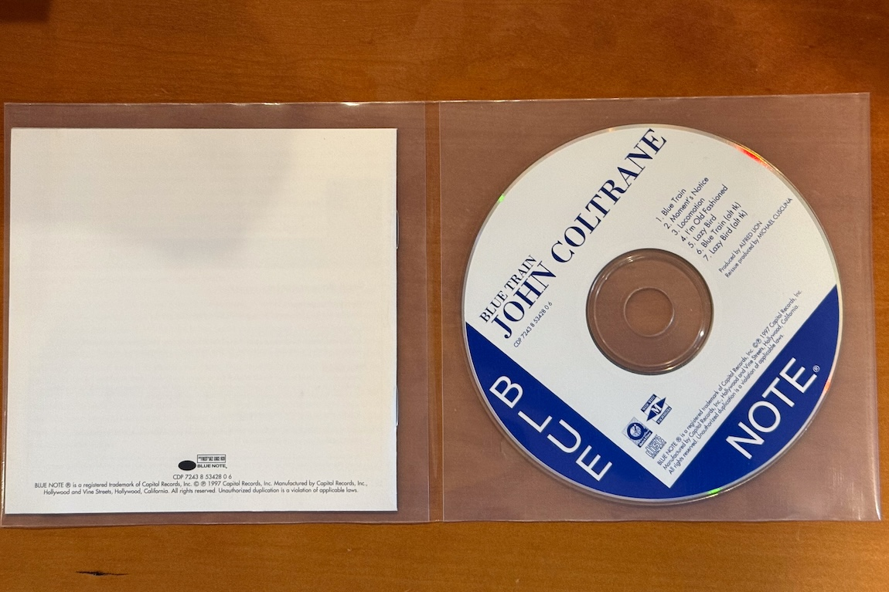

In the past I have remarked, perhaps repeatedly, about how bad CDs are as a physical
artifact of a particular musical recording. I will quote myself:

> CDs, as I have remarked before, are a terrible product for that. CDs carry music just
fine, but everything else about them and their packaging is a soul-less black hole that is
completely devoid of any artistic or emotional connection.

Having spent the last few months either re-ripping or otherwise re-cataloging a lot of the
CDs I have had sitting around the house I now have a pretty comprehensive list of every
single terrible CD packaging idea that has ever existed. Plus the one that is good.

#### The Good One

These thin [gatefold plastic
sleeves](https://slim-disc.com/products/cd-storage-system-double-pocket) are the best. I
had used a version of these in the past to get a lot of my disks out of the giant hateful
jewel boxes (see below), but when I originally started the ripping and cataloging project
I could not find them anymore. So I have a bunch of disks in single pocket sleeves that
are OK but not as good. These double pocket sleeves are the best because

1. The stupid mini-booklets that you will never read actually fit in the pockets and are
   easy to extract and replace.

1. It's easy to fit a two CD release into one sleeve. If you are careful you can sometimes do
   three disks. But you can always nest one sleeve inside another to go from two CDs to
   three or four.
   
1. If you like the back panel artwork on some disk you have you can rip it out of the
   jewel box and insert it into the sleeve and it still works.

I'm happy to have found these again. I bought a several hundred so I hopefully will not
run out this time.

Here is my favorite record of all time happily tucked into one of these sleeves:

> 

> 

OK. With that out of the way here are all the ones that suck:

#### Jewel Boxes

These are the original sin, and have always sucked. First, they are 15 times thicker than
the disk they hold. Second, for all the bulk they do a shitty job of holding the liner
books and sometimes even the disk because the little teeth that hold the disk in the disk
spot break off and stop working. The only good thing about them is you can read the titles
on the spines. But meh.

The one time these are OK is if they are in a giant Mosaic boxed set and the bigger nice
box is holding the shitty boxes, and there is a bigger book with all the notes instead of
the moronic mini-paper-back thing.

#### Cardboard Gatefolds

The very best LP packages are the luxurious double gatefold sleeves with giant cover art
and readable liner notes.

The CD version of this, with a double or worse, triple gatefold with the tiny shitty book
on one side and the poor plastic disk on the other is the absolute worst. The package
never lets go of the things it's holding, and the cover art has to be shrunk to
microscopic proportions to fit on the tiny little mini-sleeve. All this and it takes up
barely less room than the jewel box. Stupid.

#### Novelty Metal Boxes

A lot of fancy boxed sets come in giant boxes made of metal that don't fit into any
regular sized shelving. Because the way you really want to store your disks is in a
glorified cookie tin.

I've complained about the worst example of this already: the Miles/Coltrane Columbia set
is six CDs stuffed into a fold up book with one sleeve per disk which is then crammed into
a 2lb box which in turn goes into a useless outer sleeve.

Speaking of fold up books.

#### Accordion Boxes

I don't know what marketing genius thought stuffing multiple CDs into a shrunk down
trapper keeper style accordion file would be a good idea but they should be banned from
ever designing packaging again. At least these days you can rip the disks, stuff them back
in this god forsaken box and forget that they exist. The liner book that is sewn into the
disk sleeves was printed in type too small to read anyway.

#### Strange Aspect Ratio Boxes

A lot of record company people think it's fun to make the book that came with your giant
boxed set a weird shape. Here is the very worst one ever:

> 

Yes they printed the _liner notes_ in that god forsaken aspect ratio. The disks are
somehow stuffed in there too.

Sadly this the _only_ way to get all the material that was in this set because all of the
streaming or download versions of the album are missing some tracks because of rights
issues.

Anyway, again the only blessing here is that you can rip the disks and then throw them
away.

#### Single Pocket Mini-LP Sleeves

These are actually OK in the context of those huge boxed sets that collect together all
5500 records that some conductor or other made for some record label back in the day. It's
hilarious when companies print the original liner notes on the back of these though. The
type is so small the only way to read it is to take a photo with your phone and blow it
up.

At least these things don't take up a lot of room. A 10 CD set fits in a small box barely
bigger than two jewel boxes. So OK.

In conclusion: just sell me a full sized liner book with a USB stick in it. Or better yet,
a nice vinyl LP record, also with a USB stick in it.
