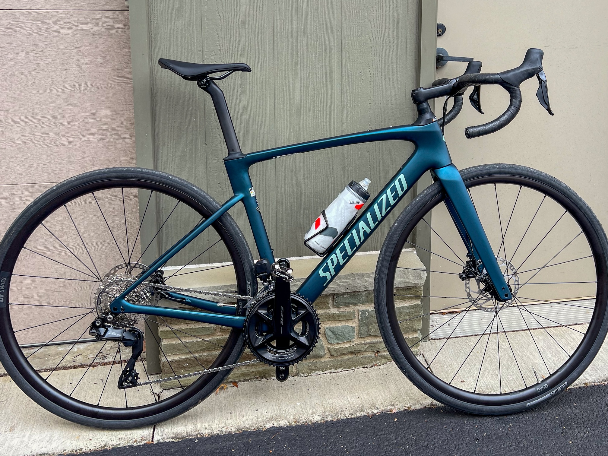

Another September has rolled around which means two things:

1. The pumpkin spice signs are starting to appear at local coffee places, like, er,
   Mcdonald's.

and

2. It's time to look back at my Strava and note how I did average on distance, but as usual got
   slower year over year.

But this year's twist is that (2) did not happen. For the first time since I started using
the service in 2012 I did very much above average on _both_ distance _and_ speed.

I have three partial reasons why this might have happened this year. First, like in 2012 I
bought a new fast bike. Really I got it at the very end of last year. I had been on the
lookout for one of the new-fangled electronically shifting Shimano Di2 bikes for a while,
but since 2020 they had been mostly out of stock, or way too expensive. But for 2024
Specialized put out this thing, which is their semi-fancy _Roubaix_ carbon frame, with the
springy headset and the new Shimano 105 Di2 for shifting:

> 

This bike reflects the best thing to happen to road bikes in the last 40 years, which is
that they have borrowed design cues from the gravel bikes to finally give us a fast frame
with actually fatter tires and a relatively more comfortable riding position. As such,
this bike is somewhat lighter and faster than my even fatter tire steel gravel bike. In
addition the springy front takes the sting out of the shitty Pittsburgh washboard making
the bike much more comfortable than my previous full on carbon road bike and almost as
comfy as the fatty tire machine. 

Finally, the Di2 drivetrain shifts the chain around with barely any effort on my part at
all. It's like having a spooky ghost shifting the bike for you, at least when the
batteries are topped up (ugh). My main complaint is that I've had the chain slip off the
front a few times. But I also have a constant low level anxiety about the batteries, or the
inscrutable embedded computer deciding to go out to lunch while I'm out and about. The
fact that each of these things has happened once already in the first year or use does not
help my mental state.

The second obvious reason for my cycling victory this year was that last year I rode until
November, and this year I rode starting in February and March. Thanks climate change! The
result was that by the end of June I had already passed my total from last year, which was
already higher than I had done in a while. As we move into September I'm past the most
miles I have ever recorded on Strava. And we probably have another two
months of riding to go assuming there are no disasters.

Finally, the only explanation I have for the increased speed is a combination of extra
conditioning from the longer riding season and having the spent last year and a half
losing some weight. Suffice to say all those 2012 Strava PRs have been dropping like
flies. At least the ones that are on my short loops. The main thing I have not done this
year is single day distances longer than about 25 miles. Maybe next year.

