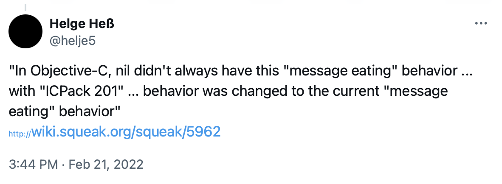
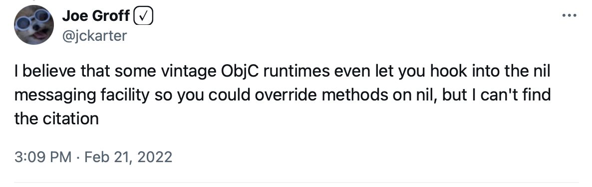
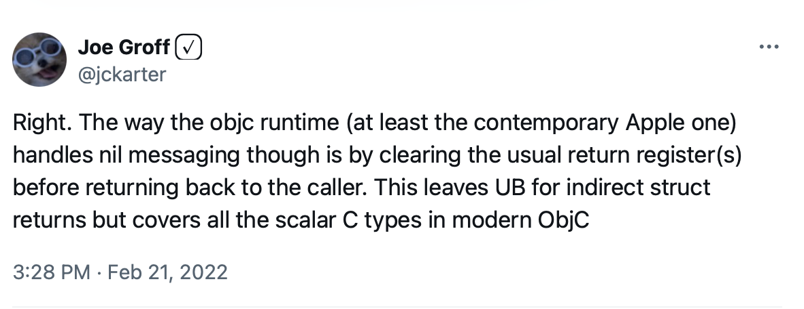
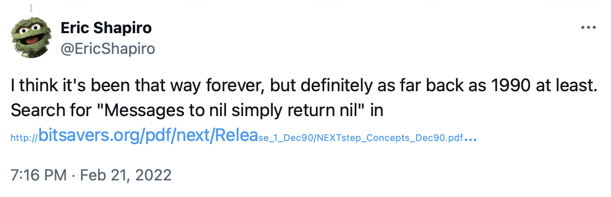

Long time readers of this site will know that I have spent a non-trivial portion of my
adult life writing Objective-C code for the NeXT\^H\^H\^H\^H MacOS and iOS platforms at
various stages of their development.

One quirk in the Objective-C runtime that every programmer needs to deal with is the
following strange behavior: if you call a method on an object that is `nil` the call just
falls through like nothing happened (usually).

That is, if you make a call like this:

```
result = [someObject someMethod:someArgument]
```

and `someObject` is the value `nil`, so it points at nothing, the behavior of the
Objective-C runtime is just to ignore the call like nothing happened and
effectively return a value similar to zero or `nil`.

In the more modern versions of the runtime, the area that the runtime uses to write the
result of the method call is zero'd out no matter what the type of the return value will
be. In older versions of the runtime you could get into trouble because this "return 0"
behavior only worked if the method returned something that was the size of a pointer, or
integer, on the runtime platform. And on PowerPC if you called a method that returned a
`float` or `double` you could get all kinds of [undefined
suffering](https://twitter.com/grynspan/status/1495908459916795907).

Anyway, I was having a chat with a nerd friend of mine at work, and we both got curious if
this behavior dated back to the _original_ Objective-C runtime or if it was added at some
point. With the entire Internet at our fingertips surely this could not be that hard to
figure out.

So I poked around, and the earliest reference that I could find with straightforward
searches was a reference to this behavior on USENET in 1994:

You can read that
[here](https://groups.google.com/g/comp.lang.objective-c/c/P3MntDvO1BM/m/FfkH12mjIQUJ).

I did manage to find a copy of the original Objective-C book on
[archive.org](https://archive.org/details/objectorientedpr00coxb), but there is no mention
of this behavior in that book.

I also found [this historical article from the ACM last
year](https://dl.acm.org/doi/10.1145/3386332) but it also did not specifically talk about
the `nil`-messaging behavior.

Then I realized I should search [bitsavers.org](http://www.bitsavers.org/pdf/) but I
really wasn't sure what to look for and the site was loading slowly. Disappointed, and
feeling lazy, I decided to see [what twitter
thought](https://twitter.com/psu_13/status/1495849554108989444):

<a href="https://twitter.com/psu_13/status/1495849554108989444"></a>

This, it turned out, was the perfect thing to use the giant nerd village for.

Within just a few minutes there was a fairly heated twitter back and forth, and eventually
I got [this message](https://twitter.com/helje5/status/1495861914605432837), which I have
also saved here as a screenshot:

> <a href="https://twitter.com/helje5/status/1495861914605432837"></a>

**Note from 2024**: In the fall of 2022 twitter was acquired and then ended up as just a
shadow of its former self. As a result a lot of the links I had here before have disappear
into the ether. So I removed the section that had the rest of the light hearted banter.
Sigh. After noticing this I did save a few of the most relevant ones that I could as
screen shots. Like these two messages about runtime minutiae:

> <a href="https://twitter.com/jckarter/status/1495853328420552708"></a>

> <a href="https://twitter.com/jckarter/status/1495857998845349888"></a>

Such is life with the modern Internet.

**Back to 2022**

So now we have the following facts:

1. The long post verifies that the original Objective-C runtimes threw an error when told
to send messages to `nil`, and that this was changed to the current fall-through behavior
in a release of some software called "ICPack 201". This package was released by a company
called Stepstone, which originally developed and owned the language in the 80s.

2. The only information about this company that I could find on the Internet was [the
wikipedia entry](https://en.wikipedia.org/wiki/Stepstone) which mentions "ICPack 201" but
does not say when it was released. But, it _does_ say that the package was proposed to the
Open Software Foundation when they did their Request for Technology for their window
management system, the software that eventually became _Motif_ (shudder). 

3. Now, the [wikipedia entry for Motif](https://en.wikipedia.org/wiki/Motif_(software))
says that the RTF for the OSF window manager happened in 1988, so this mean that "ICPack
201" must have shipped sometime around 1988. Hooray!

Finally, a few hours later I got this reference to more [NeXT documentation from
1990](https://twitter.com/EricShapiro/status/1495915397069090816):

> <a href="https://twitter.com/EricShapiro/status/1495915397069090816"></a>

Of course this manual is on
[bitsavers](http://www.bitsavers.org/pdf/next/Release_1_Dec90/NEXTstep_Concepts_Dec90.pdf),
like I figured it would be. 

While in the end I could have found it myself, the great nerd convergence around this
question was kinda fun.

But, don't let this apparently heartwarming story change your mind about twitter. It's
still a cesspool that [should mostly be
avoided](http://mutable-states.com/anti-social-social-networking.html). 

But once in a while it's not too bad.

#### Final Note

It turns out that I did find [this stackoverflow
thread](https://stackoverflow.com/questions/11530133/why-is-it-that-sending-any-selector-to-a-nil-object-does-nothing-but-sending-an)
in my first few searches, and it also has the reference to the Squeak post. But I missed
it my first time through. So there you go. If I had had better eyes I would have missed
out on a minor twitter storm.
