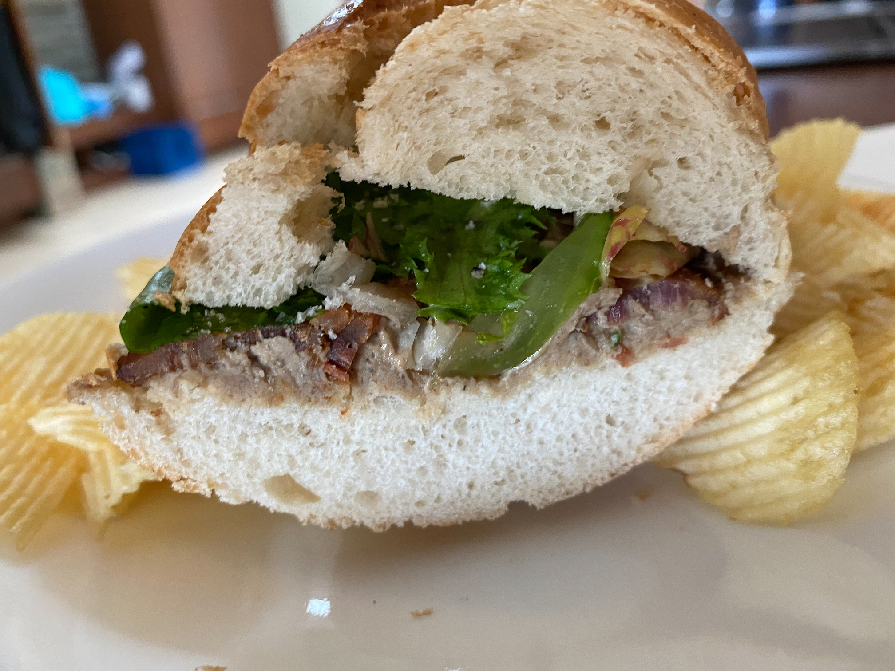
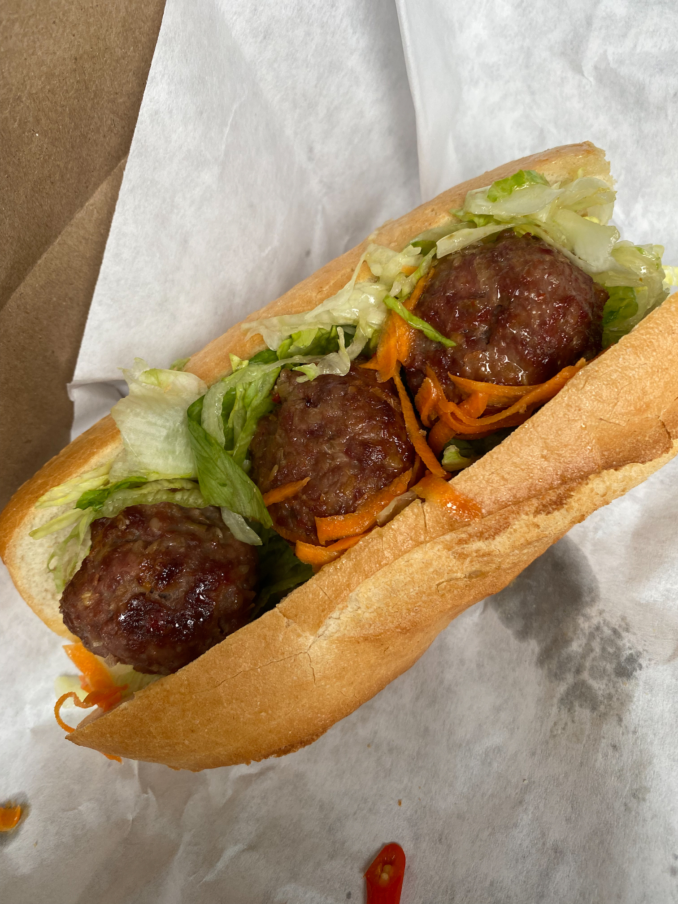

Our old friends from the Thin Man sandwich shop did a popup today in the space that Black
Radish uses as a catering kitchen. Thin Man closed in 2017, a casualty of skyrocketing rents
in the Strip District.  But while they were open they were
easily doing some of the best sandwiches in town.

Their signature eponymous sandwich, the *Thin Man*, is a thick schmear of a great chicken
liver mousse, endive, and bacon on a crusty roll:

Today they also had a spicy Vietnamese style beef meatball sub, that was great.

Anyway. I post this just as an extended shout out that does not fit well into our
currently shitty social media channels. And also to point out that I realized at this
event that in my [earlier missive about perfect
sandwiches](http://mutable-states.com/the-perfect-sandwich.html) I had left Thin Man off
the list. And I should not have. Their stuff is great, and as good as I've ever had.
Though the bread might be a bit too fancy. And don't sleep on the chicken liver mousse.
Get thee to the next popup and get some, if you can.
