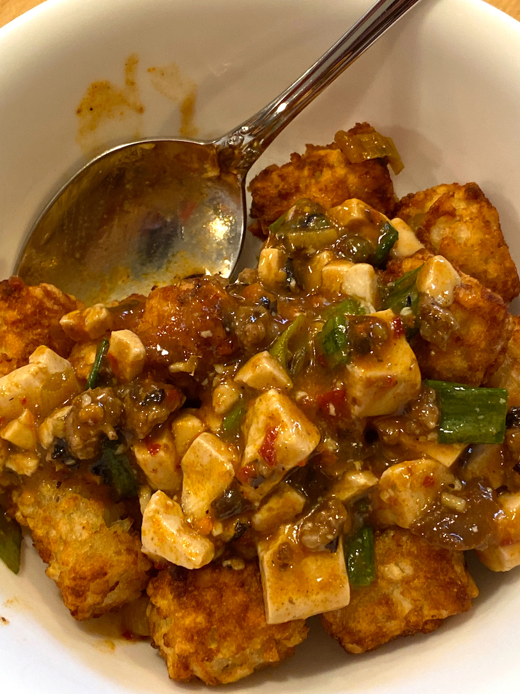
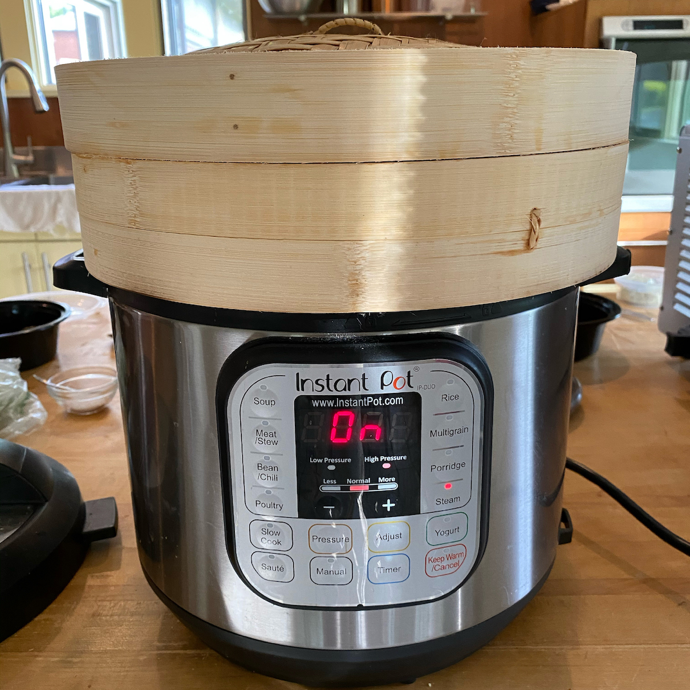

Today a few things that I've added, or improved, to my home kitchen repertoire since the
great darkness began. No sourdough bread here, sorry.

#### Ma Po Tofu Tater Tots

OK. This is a bit of a cheat since I've already mentioned this in my <a
href="https://mutable-states.com/2020-for-2020.html">ode to ma-po tofu in 2020</a> earlier. Still, it
deserves another mention. Make ma-po tofu, put it on tater tots.

> 

That's all.

#### Fish Congee

I stole this idea from [this guy](https://www.youtube.com/watch?v=SMJKE4EN-Ts), but
tweaked it a bit for my own style.

You can do this an Instant Pot (best), rice cooker (also good) or on the stove (probably
fine, but tedious). Put the following things in the pot:

1. 1 rice cooker measuring cup of rice. These are smaller than an actual cup measure. But
  don't know by how much.

2. 6 to 7 cups of water, or water and chicken stock.

3. A bit of "chicken powder", or MSG, or both.

4. 5 or 6 big slices of ginger.

5. 1 4-6oz piece of frozen white fleshed fish fillet (cod or whatever). This is the one sort of fish I buy from Whole
   Foods.

Turn the pot on. For the Instant pot I run a "porridge" cycle which is 10-15min at high
pressure. You should run whatever cycle is appropriate for your device. When the pot is
done, stir the rice around. Add some soy sauce, salt, white pepper, and green onion. Now
you have hot breakfast for a week. Throw a soft egg on top for an extra bonus.

#### Boiled Chicken

Gently poached chicken has been a staple of mine for years. But
I thought I'd make an extra shout for it out now for two reasons:

* More people need to see this. This is so much easier and better (in some ways) than
  roast chicken. I don't know why it's not more of a thing.

* This technique plays a big part in Dave Chang's new cookbook. So I gotta ride that train
  too.

Here is what you do. First, buy a medium sized whole chicken. 3 to 4 pounds is ideal.

Now fill a pot with enough water to cover the chicken. Bring it to a soft boil and dunk
the chicken in. If you troll around youtube you'll see a technique involving multiple
dunks. But you don't need to do this. Just drop the chicken in the water and turn the heat
to low. Eventually the water will come back to a gentle simmer. Cover the pot and let the
chicken sit like that for, say, twenty minutes to an hour depending on how cooked you want
the meat. Then turn the heat off and let the chicken sit some more.

When you are done you'll have beautifully tender, soft and moist chicken meat. Pull it all
off the carcass and put it in the bowl to drain and dry off. If some of the meat is not
completely cooked, don't worry. You can finish it off later when you use it in some other
dish.

Now take the mostly bare bones and put them back in the pot with onion, celery, carrots
and whatever else you want (or, for a more Chinese/East Asian style stock, just some
celery, ginger and green onion) and simmer that for another couple of hours. Pour out into
pint containers and stick them in the freezer.

Now you can make at least two meals in any number of ways.

For chicken rice, take some rice and put it in the rice cooker with the stock. Cook as
normal, serve with the poached meat from above, some [ginger scallion
oil](https://thewoksoflife.com/raw-ginger-scallion-oil/) and chili sauce.

For chicken soup saute some onion, celery and carrots in a soup pot on medium heat until
they get soft. Then add stock, water, white wine, your favorite greens, and some of the cut up
meat. Bring up to a boil and then simmer it for a while. Finish with salt, white pepper, fish
sauce or soy sauce and a bit of MSG. 

For an extra umami bomb soup try the [mushroom soup](./dinner-in-half-an-hour-mushroom-soup.html).

Add the cooked meat to your congee for extra protein.

For chicken and biscuits ... start the same way as the chicken soup, but only add a cup or
two of stock and then thicken the whole thing with a "bechamel" that you make from half a
stick of butter, 4 tablespoons of flour and a cup of milk. Cook that until it's nice.
Serve on top of biscuits.

The possibilities are endless.

Extra note: the skin on a poached chicken seems to be a thing people disagree about.
Chinese people seem to love it. Others, no so much. More for me.

#### The Instant Pot Steamer

This is the single best cooking idea I've had in ten years.

> 

#### Baconeggandcheese

The NYC egg and cheese (or, more correctly, baconeggandcheese, one word) is a particular
class of sandwich that is hard to find other places. A few places in Pittsburgh try to do
breakfast sandwiches but mess them up by fussing too much over the bread, or by doing them
on horrible biscuits, or committing any number of other sins. But, one local place has
done this really well: The Pear and the Pickle. But, the pandemic has been hard on them,
and it's not clear whether they are going to come back next year.

So I have been experimenting with this dish at home, especially after noting that I could
buy the same rolls that P&P use in their shop (the rolls are very important). So here is
what I do. 

You need: a bag of Mancini's Egg Kaiser rolls, one egg, some bacon, and one
slice of Kraft American cheese. 

1. Cook some bacon however you like to. I make it crispy in a pan, or microwave.

2. Make a soft fried egg with a bit of salt and pepper. You don't need too much salt,
   since the Kraft Single and the bacon will be salty.

3. While the egg is cooking (for 3 or 4 min) cut a roll in half, put a the Kraft Single on
   one half and put both halves in your toaster oven and lightly toast it. It takes my
   toaster just about 4min to get the roll to the right state and melt the cheese a bit.
   You don't want it all the way toasted ... just a bit, to dry out the upper layers of
   the roll and make it a bit squishy.

Now lightly squish both halves of the roll and then put in the egg and bacon to construct
the sandwich. Cut in half and enjoy.
