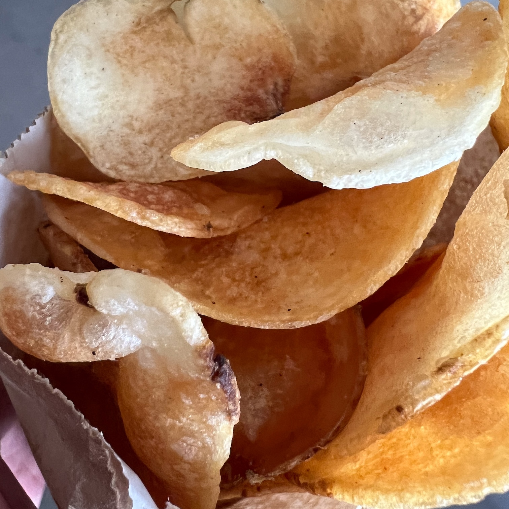

Long time readers of this site and other people who know me know that I have a generally
well earned reputation for having an overly negative world view. In my defense a lot of
the world is really stupid.

A lot that happened in 2024 served to reinforce my default point of view. Our politics
again put forth a choice between a geriatric orange asshole convicted of multiple crimes
or the last minute replacement for a geriatric placeholder who still mostly represented
views and interests that were already stale 30 years ago and mostly targeted at the
population of people who thought the geriatric placeholder was a best idea running.

Meanwhile, the biggest idea in the software industry these days is stealing content to
"train" a giant statistical language model to give you "answers" that are wrong a good
percentage of the time. Everyone appears to be killing themselves to jam these idiot bots
into your favorite software systems so that they can do things no one asked for at a level
of correctness that no one used to call acceptable. All this instead of spending time
making new software that is actually useful for solving actual problems in a deterministic
way instead of a probabilistic one. Maybe it's time for me to get off the train.

But, enough of that. Instead of dwelling on the enraging bullshit I will now endeavour to
allow you to spend the rest of your time on this web site in 2024 reading about things I
actually liked. That might be harder to do, but it will be more fun in the end. After all,
the best way to maintain a more positive disposition is to just say "fuck it" and ignore
the dipshits and the assholes. So here we go.

#### Forno Brenci

Forno Brenci sells baked goods at the Bloomfield farmer's market in the spring, summer and
fall. I somehow spaced out and left them off my recent [food
list](10-things-to-eat-in-pittsburgh-before-you-are-dead-2024.html), so I'm fixing that
now. His flat breads, focaccia, pizza and sandwiches are great. But his sweet stuff is
great too. The gluten free chocolate chip banana bread is standout. And, this year he
started selling a thing called a "Ciavattoni" filled with sweet cheese and chocolate that
is to die for. It's also much the same pastry as a thing we in Pittsburgh had only known
as a "mele" from the original Piccolo Forno and now Colangelo's's Bakery in the strip. Go
get it.

#### New Carnegie Music Hall

They renovated the inside of the Carnegie music hall. The seats are a lot bigger and more
comfortable now. This will make the live shows there a lot nicer.

#### New Asian Food Things

The gradual entanglement of all things Asian food into the fabric of the Pittsburgh food
scene continued apace in 2024 and _I am here for it_. We have a new Asian themed food
hall, three or four new spots in Squirrel Hill, a much larger rebuild of the _Many More_
food store in the strip and the continued ascension of _Pusadee's Garden_ as at least one
of the top two or three destination fine dining spots in town. A less visible, but even
more pleasing effect of all of this has been the gradual appearance of really high quality
East Asian produce at the local farmer's markets. Scallions that are the right size,
multiple varieties of actually baby sized baby bok choy, those great long skinny
eggplants. What is not to love.

#### Eclipse and other Sky Things

The [eclipse](eclipse-2024.html) was great. The [auroras](photo-realistic.html) were great
too.

##### Live Music

In the past my live music life has consisted mostly of PSO shows, Pittsburgh Chamber music
shows and not too much else. In the last few years I've added two other regular venues to
these: the Jazz shows at City of Asylum, and the various student and faculty concerts at
CMU. Having been in the city so long, and having gone to CMU as a student it's a bit
embarrassing to say that I never went to the shows at the music school there until
recently. But there you are. I'd say that if you want a low risk high reward way to get
into the Classical Music world they are the biggest bargain going. And, the range of
repertoire that they play is a lot wider than most of the other places in town. So that's
a bonus too.

#### Fat Butcher

Fat Butcher is a new (since last year) butcher, packaged meat, and prepared food store in
upper Lawrenceville. While it has a bit of an extra-bougie hipster vibe two things are
undeniable:

1. The meat is great. All of it.

2. They have the best smash burger in town.

So drop by.

#### The Best Potato Chips I Ever Had

This summer we took our first trip to Montreal. There was a spot near our hotel called
Baguette/Brochette that served various kinds of grilled meat/veggie sandwiches and bowls
and stuff. So of course we dropped by for a snack. As I was finishing my order I spied
some freshly made potato chips near the register at which I was paying. So of course I
added them to the order. And the nice lady gave me a bag to munch on while we waited for
the meat salad to be prepared. Here is what they looked like:

> 

These were the best chips I have ever had. Then later when I went back to pick up our
order, the nice lady put _another_ batch in the bag holding our meat salad. Bonus.

#### Wagnerism

_Wagnerism_ is Alex Ross's ultra long-form mediation on the artistic influence of Richard
Wagner from the 19th century until the late 20th century. This year, after nearly four
years of mostly using the audio version of this book to fall asleep again if I woke up at
4am (shame!), I finally managed to actually read and listen to all of it.

This motivated me to try and listen to the rest of the operas that are not the Ring
(mostly successful) and also to pick up and try to read _Ulysses_ (we'll see).

I haven't figured out how I feel about the book yet.

#### Smaller Cameras

After hauling the relatively small Olympus micro-4/3rds cameras on another trip (Montreal)
and not really using them much I decided to try and pick up a non-phone camera that is
even smaller.

As much as it pains me to admit this, there is really only one choice in this space: the
Sony Cyber-shot DSC-RX100 VII.

The Sony camera catalog is made up of literally dozens of different products all of which
are the same, but have slightly different names. Their smaller point-and-shoot type
machines are no different. This particular one is the 7th iteration of the smallest thing
they make, but confusingly you can still buy at least two or three of the other ones.

Anyway. The camera is great. It's small, its focus system is more advanced and better
performing than any Olympus body, and these days the thumbnail sized sensor is usually not
much of a handicap. The files are probably as good as the older DSLR and mirrorless files
that I have been perfectly happy with for the last decade.

Maybe I'll look into Sony's "real" mirrorless cameras now... once I can figure out the
difference between an A1, A9, A7, A7s, A7r, A7c, A7cr, A7III, A7IV, A7DX, or the A7LXIV
... I made couple of those up. But only a couple.

##### Physical Media (and Downloads)

Apparently this was the year everyone figured out that Spotify is bad. I'm all for this.
CDs are terrible too, but at least you can convert them into files that you can carry
around with you that don't randomly disappear due to some legal whim. And, they actually
pay somewhat real royalties to actual performers rather than just stock options to "rights
holders".

I also bought a lot of downloads, because they also avoid weird legal whims disappearing
music out of the streaming service.

I also bought a few Blu-Rays that I'll never play.

OK I'm done. See you next year.
