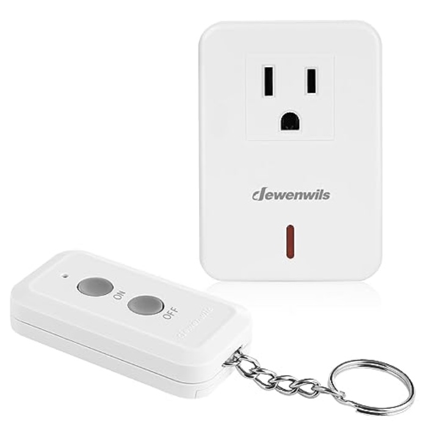

Today some short things that I could not turn into longer things.

#### Stop Making Sense

Today is Talking Heads day for me, as this long time favorite film comes back around
again. I am now old enough to have seen all three incarnations of this movie as they hit
theaters. Which is ... something.

I have nothing more to say about this but plan to have a really good time.

Edit: I actually do have one more thing to say about this. Seeing it again I'm struck by
how unbelievable it is that they could shoot this the way they did with the giant movie
cameras of the time. And that this might not be appreciated enough in these days when you
could just walk around the stage with a phone (or, more likely, any of the smaller digital
cinema cameras, that are comparatively tiny) and do it (if you knew what you were doing).

#### Pod People

Aside from some light use of the classic and now mostly forgotten [iPod
Shuffle](https://mutable-states.com/the-axiom-of-choice.html) I have mostly avoided the
smaller auxiliary computing devices that Apple makes. I carry their small pocket camera
and Internet communication device around, because if you have to carry one you might as
well carry that one. But otherwise I had never seen a reason to use their ear mounted or
wrist mounted machines because they did not do anything that I was interested in doing.

The headphones never fit, and the large ones that did fit felt more like two small
computers pretending to be headphones than actual headphones. And, I don't like watches.

But as we have learned in [other
contexts](https://mutable-states.com/why-soccer-is-better-than-your-favorite-sport.html),
you never know how these things are gonna go. So lately I have found myself using _both_
the ear pods and the watch, for various reasons that are too boring to go into.

The watch is, fine, I guess, for a watch. The bike ride tracking is finally good enough
for me to get rid of a dedicated machine just for bike ride tracking. So that's good. I
guess I don't miss as many text messages. Which is a mixed blessing. Everything else is a
collection of incoherent and inscrutable machine-learning driven heuristics that try to
dictate how to live your life ("time to standup! time to get moving!") and make you feel
bad for not fitting into the bell curves defined by the models. Also, we're up to version
_10_ of the software and it still can't do windowed averages for all of the exercise
metrics? Really?

Oh well. At least it has some comfy bands that are infinitely adjustable.

The new ear pods were a surprise. I decided to try them on a whim after getting some for
my brother. I expected them to not fit just like every Apple earbud product in since the
original iPod. But surprise, they fit perfectly. I also expected that the idiotic
bluetooth connection dance would again be 15 times worse than just unplugging from one
headphone jack and plugging into another. But surprise again ... it mostly just works. I've
still had it decide to randomly not talk to my Mac once in a while. So it's only 1.5
times worse.

Still, these are the best "listen to things in your brain holes while walking around"
headphones I've ever used. So kudos. Now I can use my walks back and forth to the new
office to polish off all those 57 disk boxed sets of the Bach Cantatas that I keep buying.

#### Internet of Shit

Back in the early pandemic we bought a new TV that hangs on the wall where my iMac used to
be. The most nerve racking part of the process at the time was letting a guy come into the
house to hang it for us.

The TV works great except for the fact that it's actually a fucking computer that runs
linux, so every few months it just hangs instead of turning on, so you have to unplug it
from the wall to get it going again. Since the wall plug is actually on the floor, under a
tall desk and difficult to reach I wanted to get a thing to do this by remote control.

Fortunately, a lot of folks appear to sell remote control power plugs. Unfortunately the
ones they want you to buy these days are all "Smart Home" devices, which means they don't
fucking work.

Here is how it goes:

- Take the plug out of the box.

- Plug it into the wall and hold your phone near it so that it can set itself up using
  NFC.

- Just kidding that shit never works. So unplug it from the wall and turn it over on its
  ass and take a picture of a small 4 digit code that has been silk-screened on the bottom
  of the device in a 7pt font in beige lettering that exactly matches the beige color of
  the body of the device.

- Type that code into your phone to pair it up.

- Spend 15min adding the device to your "Home" app.

- Three months later when the TV goes wack attempt to use the "Home" app to flip the
  switch inside the plug by remote control. This won't work because the device will have
  long since fallen off of your home Wifi network, so you won't be able to talk to it
  without going through the whole setup process again.

Because I'm a dipshit I did this with _two_ different wifi power plugs. They were probably
just the same hardware and software stack with different brand labels on them ... they
both behaved in exactly the same useless way.

Having learned my lesson, I bought this thing:

> 

This is the dumbest of all possible plugs with a switch connected to the dumbest of all
possible RF receivers.

It just sits there waiting for a radio signal to come around and tell it to do its thing.
No NFC, no pairing, no wifi, nothing "smart". Now, every few months when my "smart" TV
goes catatonic I just hit the button the thing and it reboots perfectly. This has happened
twice since I bought it in the spring.

So to summarize:

- Brainless RF controlled simple power plug with a switch in it: 2

- Fancy WiFi Internet of Things Home Control Bullshit Devices that try to do the same
  thing: -3

The Smart Home shit gets an extra point off for the initial setup pain. Why anyone would
trust anything in their house that they actually want to work most of the time to one of
these moronic Internet Home devices remains unfathomable to me.

#### Yoneda Updates

I wrote [this silly page about the Yoneda
Lemma](yoneda-speedrun.html) a couple of years back. Since then
I have continued to noodle on it and fix a never ending list of small errors and nitpicks,
including one where I left out an entire third of one of the statements of the result.
I've noodled with the [pdf
version](https://github.com/psu13/arxiv-psu/blob/main/yoneda-speedrun/yoneda-speedrun-lucida.pdf
) too. It remains the reference version and the best to read.

In fact even as I type this I just found two more horrible typos. Sigh.

#### New Bike Stuff

I got a new bike last year. It is a new-fangled "gravel" bike. Which I guess means the
road bike people finally decided to make road bikes with wider more comfortable tires and
a decent gearing range on them. But to do so they had to put the bike in a completely
different category so the road bike people don't feel like their manhoods are being
threatened. Whatever.

I didn't get to ride it much last year for reasons. But this year I've had it out a lot
and it's great. If I get my ride in today I'll make 600 miles in one summer for only the
second time in the last 10 years. Good times.

I also got some weird new bike shorts with pockets in them. I wonder why it took like 50
years of bike shorts for someone to finally try this. They are great.

Here is the bike in its peak natural habitat on a local road that has just been
"resurfaced" (wink wink).

> 

Happy fall.

#### Notes

1. As predicted, Stop Making Sense was great.

2. I got the 15 miles I needed today, so happy 600.

