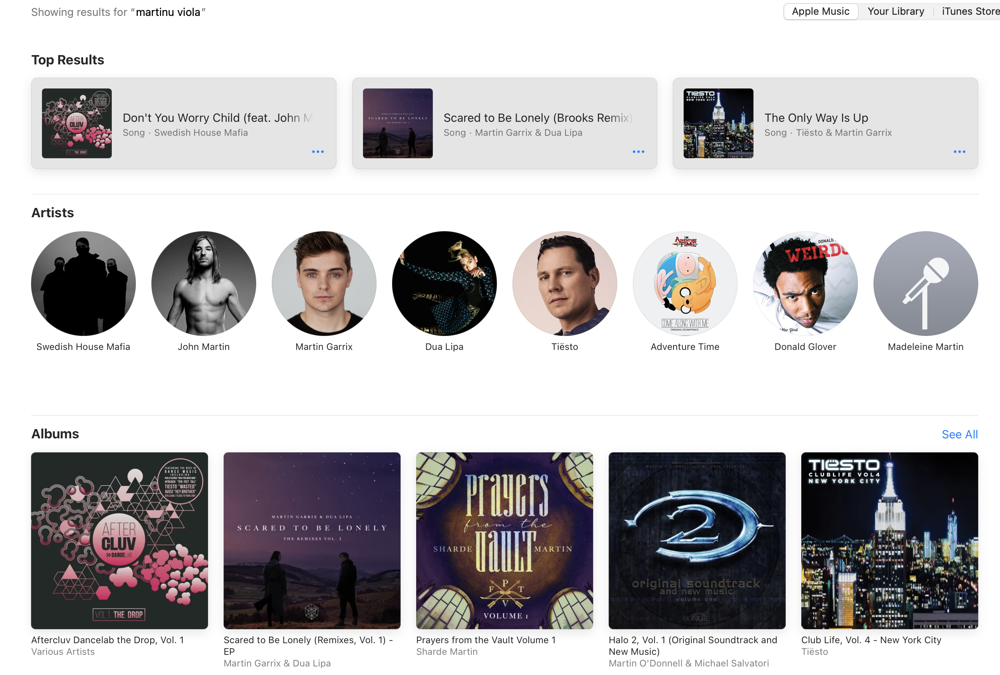

I have this long standing problem with the iTunes/iTunes Store/Apple Music catalog system.
I can summarize it in one screen shot.

Open up Apple Music on your Mac or iOS device, it does not matter, and in the search field
try and search for "Martinů viola".
[Martinů](https://en.wikipedia.org/wiki/Bohuslav_Martinů) was an early 20th century Czech
composer of modern classical music that I particularly enjoy. In particular he wrote a lot
of interesting music for viola. Anyway, here are the results you will get:

> 

Anyone who knows me has heard me complain about this behavior. My emotional state about it
swings from amusement, to detached fatalism, and occasionally to unhinged anger.

But, I have a guess about why it happens.

The thing is, the iTunes (and thus Apple Music) catalog model is built on _songs_. So the
search engine is, naturally, also oriented towards finding _songs_. So if the data you
want is not in the _song_, and in particular the _song title_ or the _main artist_, iTunes
will not find it.

But, the classical music albums (and to some extent jazz, as well) defeat this assumption
by not putting enough metadata in the songs. The titles do not contain the composer. The
main artist is usually the performer, and not the composer. The composer is shuttled off
to its own field of the song record, which I assume is either not indexed at all, or not
weighted heavily when evaluating the relevance of the search results. Here is a modest
example:

> 

Here Martinů appears in the album title and in the composer fields, but never in the
places that are important: song titles and the main artist field. The result is that when
I search for "Martinů" in the general Apple Music catalog, Apple Music does not find high
relevancy hits for the name "Martinů" anywhere, but it _does_ find good hits for various
"corrections" of the spelling of the name. So it thinks I am confused about the name and
it shows me that stuff instead. The only way to find this record is to search on the
performer's name. But that assumes that I already knew that I wanted this specific
performance, and is thus useless if I want to see all of the available performances of
some particular thing.

When I search my _local_ catalog for the same string, it does better. Partly this is
because I have adjusted my local metadata, partly this is because my local catalog does
not have as much music by popular artists whose name is a short edit distance away from
"Martinů". 

The fix for this would be to either fix the search engine (unlikely) or fix the data (also
unlikely). In
particular, if we rewrote all of the Apple Music meta-data to follow this rule from my
list of [iTunes Rules](itunes-rules.html), then things would be better:

> The second rule is: the iTunes data model is fairly simple, so aggressively de-normalize
the data. This is especially true for Classical music where the single artist single song
model really breaks down. If you are not careful, you’ll go and browse albums or songs on
the iPod and see 50,000 titles called “String Quartet XYZ in B Major” and so on. This is
useless. The solution is to put the key artist or composer in every field of the database
so they will show up in all major views in both iTunes and on the iPod. Of course, you
have to do some work to be careful and keep your de-normalized formats as uniform as
possible. Life is hard.

Basically, we should spam _all_ of the database fields with the composer name ... but
especially the song titles and main artist fields. Those are the only bits that the search
engine really seems to care about (which kinda makes sense), so we should tune the
meta-data to take advantage of this.

Then maybe people would start complaining that they get some Martinů viola concerto album
when they were searching for their favorite Martina Mcbride record. Or the Halo 2
soundtrack.

Two more notes: 

1. Spotify seems to be better at this, as it appears to realize that the name "Martinů" is
   important in this context and does not try to autocorrect it. Of course, Spotify has
   its own set of annoying issues, like being an elaborate copyright laundering scheme
   that allows the record companies to avoid paying artists for their work.

2. The best way to do these kinds of searches is to type, for example, `Martinů
   site:music.apple.com` into your favorite search engine, because just matching the
   literal text ends up working better than the various name correction heuristics in the
   music service search engines.

