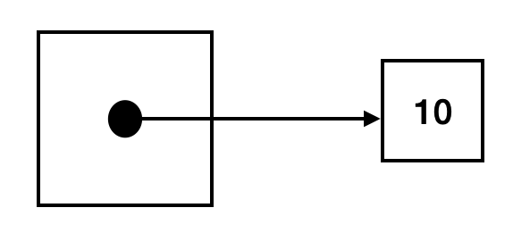
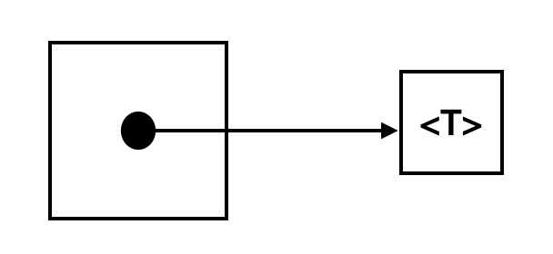
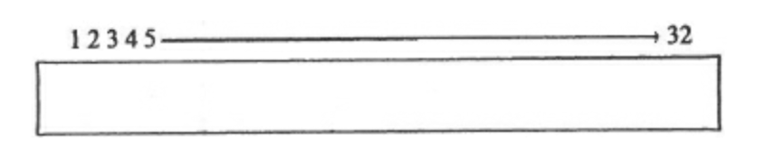
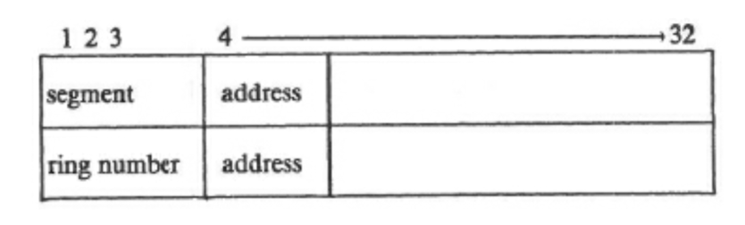

This post is brought to you by my over-developed sense of nerd engineer pedantry.

My dear friend and fellow nerd `peterb` recently posted something on twitter that I could
not let go of. He said:

> I am begging you, when introducing the topic of pointers to new learners, start off
> BEFORE drawing boxes and arrows by explaining that, in a very real sense, a pointer is
> just an integer.

I, of course, told him he was wrong. Pointers are a thing that is [much more fundamental
and much more complicated](./what-computers-do.html). We screamed at each other online and
offline for a while and came to an understanding that appeared to give us both the last
word. But the pedantic asshole in my still felt like this was a statement worth
clarifying, if for no other reason than the fact that pointers are a conceptual boundary
that trips a lot of beginning programmers hard enough that they just give up completely.

#### The Big Picture

Pointers are a type of value that programming languages use to store the _name_ of some
other value. 

In high level languages these names can be conceptually high level and abstract. They
might even be something as esoteric as a [_function_](./the-ultimate-goto.html) that
actually computes the value.

In low level languages we have traditionally thought of these names as the machine level
address at which a particular value is stored in memory.

#### The Details

It is from this second view of what a pointer might be that we can come to the idea that
it might just "be an integer". But to explain why we have to take one or two steps back.

Most programming languages define some built-in types for simple values that can be stored
and manipulated relatively quickly by the underlying machine architecture. You know,
things like integers, floating point numbers, maybe simple characters and strings but
probably not these days since those are too complicated (thanks, unicode).

Most languages also let you construct new types of things out of the simple values by
combining them in various ways. One of those ways tends to be to construct something
called an _array_ or _vector_ out of them. So, instead of a single integer (say) we can
tell the language that we want a whole bunch of them all stored sequentially. So here is
an ASCII picture of a small array that holds five small integers:

> `[ 0 | 11 | 13 | 10 | 3 ]`

If this array is called `A`, then we can reference each element, or member, of `A` using a
small index between `1` and `5`. So `A[1]` is `0`, `A[2]` is `11` and so on. Here the
small integer is called an "index", and we also say that we use that value to "index" into the
array[^1]. 

Now the nerds in the room already know where I am going with this. If you take a fairly
simple minded view of how _memory_ in a computer works, you can think of it as a giant
array of storage cells, each of which stores (usually) a value that by convention fits
into 8 bits (so a small integer between `0` and `255`). Computer memory systems are
actually a lot more complicated than this, but let's talk about that later.

In this picture, _pointers_ are just a special kind of index into this giant pool of
memory. The size of the index is defined by how many bits you need to represent all
possible addresses in the machine architecture. These days this index would be either 32
or 64 bits long. Then to see what a value a pointer is referencing you ask the memory
system to hand you back the value that is stored at the index that the pointer holds into
the giant pool of bytes. Symmetrically if you are holding on to some value, you can
construct a pointer to that value by asking the system to tell you what index that value
is stored in.

Voila, in each case you can kind of think of pointers as being these special kind of
integer indexes. Nice.

This picture of how pointers work has a lot going for it, which is why Pete was cheering
for it on the Internet. The nice things about it are:

1. It's fairly simple.
1. It's a good concrete picture of what is going on.
1. At least for older, simpler computers, it sort of matches how you can think about how
   memory works at the machine level.

Of course, there is more to the story than this.

#### Boxes and Arrows?

First, what's with the boxes and arrows anyway? You know the drill. You'll often see a
picture like this to indicate a simple pointer to an integer like we talked about above:

<center>

</center>

Here the idea is that the box holds an arrow that represents the name, or reference to the
actual value. Follow the arrow from the box to get to the actual value. This is all a bit
abstract, which is what Pete was really complaining about. Like all overly abstract
notions the thing makes perfect sense but only if you already know what it means.

In particular, if you think of the arrow (or reference, or pointer) as the index that we
talked about above, then the picture becomes more down to earth and easy to understand.
The arrow reaches into the big pool of memory and pulls out the value you want. Easy.

What the box and arrow picture _does_ capture is the higher level view of what pointers
are. Here they are more than just an index into a pool of low level machine values.
Instead they really are more of a _reference_ or a _name_ to something you want to operate
on indirectly. This is especially true languages with "advanced" type systems that don't
really make contact with memory at the machine level, but do want to provide the
programmer with an abstraction for dealing with references for various important uses
cases like:

1. Passing references as arguments to functions or procedures so that they can use them
   to push state back out to the caller (e.g. call by reference vs. call by value).
1. Building state-based data structures and algorithms.
1. Defining the notion of stateful storage cell in languages like ML or Haskell that
   otherwise do not have a notion of state. 

In other words the box and arrow tries to get at the idea that the arrow can be pointing
at a generic value of any type, including more complicated structured types, like this:

<center>

</center>

In this context the idea of a reference as a sort of abstract box that holds an "arrow" [^2]
which in turn provides a recipe for finding the value that the reference is "holding" sort
of makes sense. But what is also clear is that this picture is most important _after_ you
already understand the lower level and more concrete picture of how memory allegedly works
in an actual computer.

Of course, many languages, like Lisp and Scheme (sort of [^3]), Smalltalk, Java, Python,
Swift, and Haskell have no explicit high level notion of a _reference_. Instead these are
replaced by objects or classes or other types that might be represented internally as
references (or something more complicated), but this fact is not really made explicitly
visible to the programmer.

And here we can cue up all the pearl clutching old nerds complaining about how Gen-Z
programmers don't know how any basic thing works anymore. Which is of course nonsense.

#### The Rest of the Story

The last part of the story I want to tell is to say that even if we stay close to the
"machine" level the addresses of memory locations are still not really the same as
integers, even if they share a similar representation in the machine.

All simple values in computers are stored as (mostly) fixed size bit strings. This
picture from the classic book about 1970s minicomputers [_Soul of a New
Machine_](./the-soul-of-a-new-machine.html) can get us started. At one point one of the
engineers draws a picture of what a basic value looks like in the machine they are
building, which uses 32-bit values:

<center>

</center>

Here, as I said, every value is 32-bits long and those bits are stored such that the
higher order bits are first (index 1) in memory and the high bits are last (index 32).
These things can go the other way too.

Later on, the same engineer draws the following picture for how the data in a machine word
is interpreted as an address or pointer:

<center>

</center>

What's happened here is that they have specified that the top four bits of each address
are interpreted not just as an index into the giant pool of memory data, but also as
what is called a "security" or "privilege" ring, which is used for access control.

Thus, while the address is stored as a 32 bit string just like an machine integer might
you can't actually use the value like an integer, since some standard operations on the
value (like addition, or multiplication) can change the meaning of the value in ways that
are independent of their "integer"-ness. There is even an episode in the book where the
computer fails because one of the test programs that was running took an address and
incremented it until it fell off the end of the range of addresses that were actually
physically available in the computer.

Over time, and especially as machines moved to 32-bit and then 64-bit basic values, even
more semantics have been layered over the "integer" representation of machine addresses.
Things like:

- [Virtual memory](./what-computers-do.html) and access control, as we saw above.
- Tagged values, where data also carries a type tag that can be used for various sorts of
  runtime checks.
- "Secure" pointers, which are hashed with a private key so hostile code can't just walk
  all over memory.
- For a while there were database systems that used machine pointers as database keys.
  Luckily that idea went out of fashion.

All of these things should give one pause before trying to manipulate pointers like
integers.

Finally, we can't let this subject go without pointing out that by far the dominant
systems programming language and runtime (`C` and `C++`) has always taken a very laissez
faire attitude towards the relationship between pointers and integers. Who can forget
that code from K&R that copied strings like this:

```
while (*s++ = *t++);
```

In the fullness of time it's become pretty clear that treating pointers and integers this
way has gone very badly.

#### Conclusion

To end, my goal here was not really to dunk on my friend Pete's basic statement. This is
because I agree with it. Instead all these words were really just a warning not to take
the idea that a pointer is "just a number" too seriously. Pointers are a lot more than
just numbers and if you are not careful to remember this they have a way of sneaking up behind
you and cutting your code's throat open and laughing while the code bleeds to death on the
floor ... or at least in the debugger.

Be careful out there.

#### Notes

[^1]: For reasons that are too complicated and/or stupid to go into, most programming
    languages actually index arrays starting at zero rather than one. But I never liked
    that so I'm going to be difficult about it.

[^2]: Category theory nerds represent!

[^3]: Lisp and Scheme have an idea of `cons` cells which store pairs of values that are
    implicitly stored by reference. You use this to construct lists and things, and you
    can also use them for side effects. These are usually implemented using of pointers, but
    it's not an explicit part of the language model.
