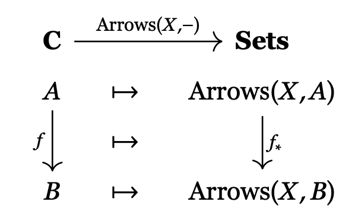

In a fit of nerd cliché, I spent the last month or two
trying to understand the *Yoneda Lemma*. It turned out that
what I really needed to do was to figure out how every different writer
comes up with their own strange notation to write the result down. So of course I 
wrote 
[a document explaining this to myself](https://github.com/psu13/arxiv-psu/blob/main/yoneda-speedrun/yoneda-speedrun.pdf).
In an equally predictable twist, to do this I made up my own notation for everything. But
I list most of the others too, since that was the point.

Then I translated the $\LaTeX$ into markdown 
(mostly with [pandoc](https://pandoc.org), I'm not an idiot) and added this blurb. 
So now you can read it here too. This page was the inevitable result of making a web site
that can render $\TeX$. So I might as well own it.

But, the pdf looks much better: 
[so you should read that instead](https://github.com/psu13/arxiv-psu/blob/main/yoneda-speedrun/yoneda-speedrun.pdf).

**Note**: I am not a mathematician or a category theory expert. I just
wrote this down trying to figure out the language. So everything in this
document is probably wrong.

**Other Note**: This document was last updated on 2025-05-05 to track a change to the
original where I tweaked some language in the definition of arrows.

#### The Big Picture

The Yoneda Lemma is a basic and beloved result in category theory. Even
though it is called a "lemma", a word usually used to describe a minor
result that you prove on the way to the main event, the Yoneda lemma
*is* a main event. It is a result that expresses one of the main goals
of category theory: it characterizes universal facts about general
abstract constructs.

Its statement is deceivingly simple [[9](https://emilyriehl.github.io/files/context.pdf)]

Let $\mathbf{C}$ be a locally small category. Let $X$ be an object of
$\mathbf{C}$, and let $F: \mathbf{C}\longrightarrow
{\mathbf {Sets}}$ be a functor from $\mathbf{C}$ to the category
${\mathbf {Sets}}$. Then there is an invertible mapping
$$
\mathop{\mathrm{Hom}}(\mathbf{C}(X, -),F) \cong FX
$$
that
associates each natural transformation
$\alpha:\mathbf{C}(X,-) \Rightarrow F$ with the element
$\alpha_X(1_X) \in FX$. Moreover, this correspondence is natural in both
$X$ and $F$.

But as Sean Carroll famously wrote about general relativity, "..., these
statements are incomprehensible unless you sling the lingo" 
[[1](https://preposterousuniverse.com/wp-content/uploads/2015/08/grtinypdf.pdf)].

I am going to do the following dumb thing: having stated a version of the lemma above I'm
going to define only the parts of the category theory needed to explain what the lingo
means. There are five or six layers of abstraction that I will 
try to explain. As for the larger meaning of the result itself, you are on your own. 
I won't explain that,
or even really show you how the proof goes.

In the spirit of video game speedruns 
[[6](https://www.youtube.com/watch?v=ImMOdTxtf-s)], 
we will skip entire
interesting areas of category theory in the name of getting
to the end of our "game" as fast as possible. Clearly this will be no
substitute for really learning the subject. Any of the references listed
at the end will be a good place to start to better understand the whole
game.

**Note**: Again, I am not a mathematician or a category theory expert. I just
wrote this down trying to figure out the language. So everything in this
document is probably wrong.

#### Categories

Categories have a deliciously chewy multi-part definition.

**Definition 1**. A *category* $\mathbf{C}$ consists of:

-   A collection of *objects* that we will denote with upper case
    letters $X, Y, Z, ...$, and so on. We call this collection
    $\mathop{\mathrm{Objects}}(\mathbf{C})$. Traditionally
    people write just $\mathbf{C}$ to mean
    $\mathop{\mathrm{Objects}}(\mathbf{C})$ when the context
    makes clear what is going on.

-   A collection of *arrows* denoted with lower case letters
    $f, g, h, ...$, and so on. Other names for *arrows* include
    *mappings* or *functions* or *morphisms*. We will call this
    collection $\mathop{\mathrm{Arrows}}(\mathbf{C})$.

The objects and arrows of a category satisfy the following conditions:

-   Each arrow $f$ connects one object
    $A \in \mathop{\mathrm{Objects}}(\mathbf{C})$ to another
    object $B \in \mathop{\mathrm{Objects}}(\mathbf{C})$ and we
    denote this by writing $f: A \longrightarrow B$. $A$ is called the *source* (or *domain*) of
    $f$ and $B$ the *target* (or *codomain*).  Source and target are somewhat more
    intuitive terms, but domain and codomain connect the language to functions in other
    areas of mathematics.

- For any two objects $A, B$ we denote the collection of all arrows from $A$ to $B$ as
$\mathop{\mathrm{Arrows}}_{\mathbf{C}}(A,B)$, or just $\mathop{\mathrm{Arrows}}(A,B)$ if
the context makes the category obvious. We also write $f: A \to B$ as a synonym for $f \in
\mathop{\mathrm{Arrows}}(A,B)$.

-   For each pair of arrows $f:A \longrightarrow B$ and $g : B \longrightarrow C$ we can form a
    new arrow $g \circ f:
    A \longrightarrow C$ called the *composition* of $f$ and $g$. This is also
    sometimes written $gf$.

-   For each $A \in \mathop{\mathrm{Objects}}(\mathbf{C})$
    there is an arrow $1_A: A \longrightarrow A$, called the *identity* at $A$
    that maps $A$ to itself. Sometimes this object is also written as
    $\mathrm{id}_A$.

Finally, we have the last two rules:

-   For any $f: A \longrightarrow B$ we have that $1_B \circ f$ and $f \circ 1_A$
    are both equal to $f$.

-   Given $f: A \longrightarrow B$, $g: B \longrightarrow C$, $h: C\longrightarrow D$ we have that
    $(h \circ g) \circ f = h
    \circ (g \circ f)$, or alternatively $(hg)f$ = $h(gf)$. What this
    also means is that we can always just write $hgf$ if we want.

The definition of categories is an abstraction of many different kinds of definitions in
mathematics where we are given a some collection of things and some structural rules. The
main example of a category that we will be concerned with is the category ${\mathbf
{Sets}}$, where the objects are sets and the arrows are mappings between sets. In this
context something interesting to think about is how the definition of a category only
tells you that each mapping $f: A \longrightarrow B$ acts on things in $A$ and sends them
to things in $B$. There is nothing said about the specific action of $f$ on any single
element of $A$. Category theory only ponders aggregate questions.

I have broken with well established tradition in mathematical
writing and mostly spelled out names for clarity rather than engaging
in the strange and random abbreviations that I see in most category
theory texts. The general fear of readable names in the mathematical
literature is fascinating to me, having spent most of my life trying to
think up readable names in program source code. 

Thus, I like things like my notation $\mathop{\mathrm{Arrows}}(A, B)$ for the collection
of arrows between two objects because it is clear and to the point as opposed to the more
standard $\mathop{\mathrm{Hom}}(A, B)$ or
$\mathop{\mathrm{Hom}}_{\mathbf{C}}(A,B)$, or $\mathop{\mathrm{hom}}(A,
B)$ or just $\mathbf{C}(A,B)$. Here
"$\mathop{\mathrm{Hom}}$" stands for homomorphism, which is a standard word for
mappings that preserve some kind of structure. But why bother with all that mental overhead.

Similarly, life is too short to
deal with names like $\mathop{\mathit{ob}}$, or $\mathbf{Htpy}$, or
$\mathbf{Matr}$. Luckily, for this note the only specific category that
we will run into is the straightforwardly named ${\mathbf {Sets}}$,
where the objects are sets and the arrows are mappings between sets.

Speaking of sets, in the definition of categories we were careful about
not calling anything a *set*. This is because some categories involve
collections of things that are too "large" to be called sets and not get
into set theory trouble. Here are two more short definitions about this
that we will need.

**Definition 2**. A category $\mathbf{C}$ is called *small* if
$\mathop{\mathrm{Arrows}}(\mathbf{C})$ is a set.

**Definition 3**. A category $\mathbf{C}$ is called *locally small* if
$\mathop{\mathrm{Arrows}}_{\mathbf{C}}(A,B)$ is a set for every
$A, B \in \mathbf{C}$.

For the rest of this note we will only deal with locally small
categories because in the setup for the lemma we are given a
category $\mathbf{C}$ that is locally small.

Finally, one more notion that we'll need later is the idea of an
*isomorphism*.

**Definition 4**. An arrow $f: X \longrightarrow Y$ in a category $\mathbf{C}$ is an
*isomorphism* if there exists an arrow $g: Y \longrightarrow X$ such that $gf = 1_X$
and $fg = 1_Y$. We say that the objects $X$ and $Y$ are *isomorphic* to
each other whenever there exists an isomorphism between them. If two
objects in a category are isomorphic to each other we write $X \cong Y$.

Note that in the category ${\mathbf {Sets}}$ the isomorphisms are
exactly the invertible mappings between sets. An invertible mapping is
also called a *bijection* (because it's injective and surjective, you
see), so you will see that word sometimes.

#### Functors

As we navigate our way from basic categories up to the statement of the
lemma we will travel through multiple layers conceptual abstraction.
At the base of this ladder
are the categories which themselves are already an abstraction of the many ways
that we express "mathematical structures". But we have much higher to climb.
Functors are the first step up.

Functors are the *arrows between categories*. That is, if you were to
define a category where the objects were all categories of some kind
then the arrows would be functors.

**Definition 5**. Given two categories $\mathbf{C}$ and $\mathbf{D}$ a
*functor* $F : \mathbf{C}\longrightarrow \mathbf{D}$ is defined by two sets of
parallel rules. First:

-   For each object $X \in \mathbf{C}$ we assign an object
    $F(X) \in \mathbf{D}$.

-   For each arrow $f: X \longrightarrow Y$ in $\mathbf{C}$ we assign an arrow
    $F(f): F(X) \longrightarrow F(Y)$ in $\mathbf{D}$.

So $F$ maps objects in $\mathbf{C}$ to objects in $\mathbf{D}$ and also arrows in
$\mathbf{C}$ to arrows in $\mathbf{D}$ such that the sources and targets match up the
right way. That is, the source of $F(f)$ is $F$ applied to the source of $f$, and the
target of $F(f)$ is $F$ applied to the target of $f$. In addition the following must be
true:

-   If $f:X \longrightarrow Y$ and $g: Y \longrightarrow Z$ are arrows in $\mathbf{C}$ then
    $F(g \circ f) = F(g) \circ
    F(f)$ (or $F(gf) = F(g)F(f)$).

-   For every $X \in \mathbf{C}$ it is the case that
    $F(1_X) = 1_{F(X)}$.

Thus, the mappings that make up a functor preserve all of the structure of the source category
in its target, namely the sources and targets of arrows, composition, and the identities.

If $F: \mathbf{C}\longrightarrow \mathbf{D}$ is a functor from a category $\mathbf{C}$ to another
category $\mathbf{D}$, $X \in \mathbf{C}$ is an object in $\mathbf{C}$, and $f: X \longrightarrow Y$
is an arrow in $\mathbf{C}$ we may write $F X$ to mean $F(X)$ and $Ff$ to mean $F(f)$.
This is analogous to the more compact notation for composition of arrows above.

Functors can be notationally confusing because we are using one name to
denote two mappings. So if $F: \mathbf{C}\longrightarrow \mathbf{D}$ and
$X \in \mathbf{C}$ then $F(X)$ is the functor applied to the object,
which will be an object in $\mathbf{D}$. On the other hand, if
$f : A \longrightarrow B$ is an arrow in $\mathbf{C}$ then we also write
$F(f) \in \mathbf{D}$ for the functor applied to the arrow. This makes
sense but can be a little weird. Sometimes in proofs and calculations
the notations will shift back and forth without enough context and can
be disorienting.

#### Natural Transformations

Natural transformations are the next step up the ladder. If functors are
arrows between categories, then natural transformations are arrows
between functors.

**Definition 6**. Let $\mathbf{C}$ and $\mathbf{D}$ be categories, and
let $F$ and $G$ be functors $\mathbf{C}\longrightarrow \mathbf{D}$. To define a
*natural transformation* $\alpha$ from $F$ to $G$, we assign to each
object $X$ of $\mathbf{C}$, an arrow $\alpha_X:FX\longrightarrow GX$ in
$\mathbf{D}$, called the *component* of $\alpha$ at $X$.

In addition, for each arrow $f:X\longrightarrow Y$ of $\mathbf{C}$, the following
diagram has to commute: 

This is the first commutative diagram that I've tossed up. There is no
magic here. The idea is that you get the same result no matter which way
you travel through the diagram. So here $\alpha_Y \circ F$ and
$G \circ \alpha_X$ must be equal.

We write natural transformations with double arrows,
$\alpha: F \Rightarrow G$, to distinguish them in diagrams from functors
(which are written with single arrows):

You might wonder to yourself: what makes natural transformations
"natural"? The answer appears to be related to the fact that you can
construct them from *only* what is given to you in the categories at
hand. The natural transformation takes the action of $F$ on $\mathbf{C}$
and lines it up exactly with the action of $G$ on $\mathbf{C}$. No other
assumptions or conditions are needed. In this sense they define a
relationship between functors that is just sitting there in the world no
matter what, and thus "natural". Another apt way of putting this is that
natural transformations give a canonical way of moving between the
images of two functors 
[[3](http://www.julia-goedecke.de/pdf/CategoryTheoryNotes.pdf)].

As with arrows, it will be useful to define what an isomorphism means in
the context of natural transformations:

**Definition 7**. A *natural isomorphism* is a natural transformation
$\alpha: F \Rightarrow G$ in which every component $\alpha_X$ is an
isomorphism. In this case, the natural isomorphism may be depicted as
$\alpha: F \cong G$.

#### Functor Categories

In the last two sections we have defined functors, and then the natural
transformations. Given that functors and natural transformations look a
lot like objects and arrows, the next obvious thing is to use them to
make a new kind of category.

**Definition 8**. Let $\mathbf{C}$ and $\mathbf{D}$ be categories. The
*functor category* from $\mathbf{C}$ to $\mathbf{D}$ is constructed as
follows:

-   The objects are functors $F: \mathbf{C}\longrightarrow \mathbf{D}$;

-   The arrows are natural transformations $\alpha:F\Rightarrow G$.

Right now you should be wondering to yourself: "wait, does this
definition actually work?" I have brazenly claimed without any
justification that the it's OK to use the natural transformations as
arrows. Luckily it's fairly clear that this works out if you just do
everything component-wise. So if we have all of these things:

-   Three functors, $F: \mathbf{C}\longrightarrow \mathbf{D}$ and
    $G: \mathbf{C}\longrightarrow \mathbf{D}$ and $H:\mathbf{C}\longrightarrow \mathbf{D}$.

-   Two natural transformations $\alpha: F \Rightarrow G$ and
    $\beta: G \Rightarrow H$

-   One object $X \in \mathbf{C}$.

Then you can define $(\beta \circ \alpha)(X) = \beta(X) \circ \alpha(X)$
and you get the right behavior. Similarly, the identity transformation
$1_F$ can be defined component-wise: $(1_F)(X) = 1_{F(X)}$.

There are a lot of standard notations for the functor category, none of
which I really like. The most popular seems to be
$[\mathbf{C}, \mathbf{D}]$, but you also see $\mathbf{D}^{\mathbf{C}}$,
and various abbreviations like
$\mathop{\mathrm{Fun}}(\mathbf{C},\mathbf{D})$ or
$\mathop{\mathrm{Func}}(\mathbf{C},\mathbf{D})$, or
$\mathop{\mathrm{Funct}}(\mathbf{C},\mathbf{D})$. I think we should just
spell it out and use
$\mathop{\mathrm{Functors}}(\mathbf{C},\mathbf{D})$. So there.

Now we can define this notation:

**Definition 9**. Let $\mathbf{C}$ and $\mathbf{D}$ be categories, and
let
$F, G \in \mathop{\mathrm{Functors}}(\mathbf{C}, \mathbf{D})$.
Then we'll write $\mathop{\mathrm{Natural}}(F, G)$ for the set
of all natural transformations from $F$ to $G$, which in this context is
the same as the arrows from $F$ to $G$ in the functor category.

You will also see people write $\mathop{\mathrm{Hom}}(F, G)$,
$\mathop{\mathrm{Hom}}_{[\mathbf{C},\mathbf{D}]}(F,G)$, or
$[\mathbf{C},\mathbf{D}](F,G)$ for this. Or, if $\mathbf{K}$ is a
functor category then people will write
$\mathop{\mathrm{Hom}}_{\mathbf{K}}(F,G)$ or $\mathbf{K}(F,G)$
for this.

#### Representing Functors

The next conceptual step that we need is a way to relate *functors* to
*objects*. The following definition is a natural way to do this once you
see how it works but is also probably the most confusing definition in
these notes.

**Definition 10**. Given a locally small category $\mathbf{C}$ and an
object $X \in \mathbf{C}$ we define the functor
$$
\mathop{\mathrm{Arrows}}(X,-) : \mathbf{C}\longrightarrow {\mathbf {Sets}}$$
using the following assignments:

-   A mapping from $\mathbf{C}\longrightarrow {\mathbf {Sets}}$ that assigns to each
    $A \in \mathop{\mathrm{Objects}}(\mathbf{C})$ the set
    $\mathop{\mathrm{Arrows}}(X,A)$

-   A mapping from
    $\mathop{\mathrm{Arrows}}(\mathbf{C}) \longrightarrow \mathop{\mathrm{Arrows}}({\mathbf {Sets}})$
    that assigns to each arrow $f: A
    \longrightarrow B$ a mapping $f_*$ defined by $f_*(g) = f\circ g$ where
    $g$ is an arrow from $X$ to $A$.

Here is a picture of how this works [[9]](https://math.jhu.edu/~eriehl/context/):

Check over this picture in your head, and note that there are _two_ mappings, and two
different kinds of placeholders: one for objects and one for arrows.

The notation $\mathop{\mathrm{Arrows}}(X,-)$ is a bit strange. The idea is that we have
defined a mapping with two arguments, but then fixed the object $X$. Then we use the "$-$"
symbol as a placeholder for the second argument. So $\mathop{\mathrm{Arrows}}(X,-)$
operates on all the other objects in $\mathbf{C}$ and each is named by the dummy variable
$A$. This is a bit of an abuse of notation since we are apparently using the symbol
$\mathop{\mathrm{Arrows}}$ to mean two different things (one is a set, the other a
functor). Oh well.

The mapping for the arrows works the same way. Given $A,B \in
\mathbf{C}$ and an arrow $f: A \longrightarrow B$, it should be the case that
$\mathop{\mathrm{Arrows}}(X,-)$ applied to $f$ is an arrow that
maps
$\mathop{\mathrm{Arrows}}(X,A) \longrightarrow \mathop{\mathrm{Arrows}}(X,B)$.
We will call this arrow $f_*$. If $g: X \longrightarrow A$ is in
$\mathop{\mathrm{Arrows}}(X,A)$ then the value that we want for
$f_*$ at $g$ is $f_*(g)
= (f \circ g): X \longrightarrow B$. This mapping is called the *post-composition*
map of $f$ since we apply $f$ *after* $g$. You also see it written as
$f \circ -$. The *pre-composition* map is then $f^*$ or $- \circ f$.

Thus, we have worked out that the value of
$\mathop{\mathrm{Arrows}}(X,-)$ at $f$ should be the arrow $f
\circ -$. Sometimes you will see this written
$\mathop{\mathrm{Arrows}}(X, f) = f \circ -$, which I find a
bit odd because now we are overloading the kinds of things that can go
into the "$-$" slot.

Other notations for this functor include
$\mathop{\mathrm{Hom}}(X, -)$,
$\mathop{\mathrm{Hom}}_\mathbf{C}(X, -)$, $H^X$, $h^X$, and
just plain $\mathbf{C}(X,-)$. In my notation we should have written this
as $\mathop{\mathrm{Arrows}}_{\mathbf{C}}(X,
-)$, but I'm lazy. This kind of functor is also called a *hom-functor*.

Finally, we can give two more important definitions.

**Definition 11**. Given an object $X \in \mathbf{C}$ we call the
functor $\mathop{\mathrm{Arrows}}(X,-)$ defined above the
functor *represented* by $X$.

In addition, we can characterize another important relationship between
objects and functors:

**Definition 12**. Let $\mathbf{C}$ be a category. A functor
$F:\mathbf{C}\longrightarrow{\mathbf {Sets}}$ is called *representable* if it is
naturally isomorphic to the functor
$\mathop{\mathrm{Arrows}}_\mathbf{C}(X,-):\mathbf{C}\longrightarrow{\mathbf {Sets}}$
for some object $X$ of $\mathbf{C}$. In that case we call $X$ the
*representing object*.

#### Opposites and Duals

Next we move a bit sideways. Duality in mathematics comes up in a lot of
different ways. Covering it all is way beyond the scope of these notes.
But the following definition is a basic part of category theory so it's
worth including.

**Definition 13**. Let $\mathbf{C}$ be a category. Then we write
$\mathbf{C}^{\mathrm{op}}$ for the *opposite* or *dual* category of
$\mathbf{C}$, and define it as follows:

-   The objects of $\mathbf{C}^{\mathrm{op}}$ are the same as the objects
    of $\mathbf{C}$.

-   $\mathop{\mathrm{Arrows}}(\mathbf{C}^{\mathrm{op}})$ is
    defined by taking each arrow $f :A \longrightarrow B$ in
    $\mathop{\mathrm{Arrows}}(\mathbf{C})$ and flipping their
    direction, so we put $f': B \longrightarrow A$ into
    $\mathop{\mathrm{Arrows}}(\mathbf{C}^{\mathrm{op}})$. 
    
    In
    particular for
    $A, B \in \mathop{\mathrm{Objects}}(\mathbf{C})$ we have
    $\mathop{\mathrm{Arrows}}_{\mathbf{C}}(A, B) = \mathop{\mathrm{Arrows}}_{\mathbf{C}^{\mathrm{op}}}(B, A)$
    (or $\mathbf{C}(A,
    B) = \mathbf{C}^{\mathrm{op}}(B, A)$).

-   Composition of arrows is the same, but with the arguments reversed.

The *principle of duality* then says, informally, that every categorical
definition, theorem and proof has a dual, obtained by reversing all the
arrows.

Duality also applies to functors.

**Definition 14**. Given categories $\mathbf{C}$ and $\mathbf{D}$ a
*contravariant* functor from $\mathbf{C}$ to $\mathbf{D}$ is a functor
$F: \mathbf{C}^{\mathrm{op}}\longrightarrow \mathbf{D}$ where:

-   We have an object $F(A) \in \mathop{\mathrm{Objects}}(\mathbf{D})$ for each
    $A \in \mathop{\mathrm{Objects}}(\mathbf{C})$.

-   For each arrow $f : A \longrightarrow B \in \mathop{\mathrm{Arrows}}(\mathbf{C})$
    we have an arrow $F(f): FB \longrightarrow FA$ in
    $\mathop{\mathrm{Arrows}}(\mathbf{D})$.

In addition

-   For any two arrows
    $f, g \in \mathop{\mathrm{Arrows}}(\mathbf{C})$ where
    $g \circ f$ is defined we have $F(f) \circ F(g) = F(g \circ f)$.

-   For each $A \in \mathop{\mathrm{Objects}}(\mathbf{C})$ we
    have $1_{F(A)} = F(1_A)$

Note how the arrows and composition go backwards when they need to. With
this terminology in mind, we call regular functors from
$\mathbf{C}\longrightarrow \mathbf{D}$ *covariant*.

#### Yoneda Again

Now we have all the language we need to look at the statement of the
lemma again. So, here is what we wrote down before, more verbosely, and
in my notation.

**Lemma 1** (Yoneda). Let $\mathbf{C}$ be a locally small category,
$F:\mathbf{C}\longrightarrow
{\mathbf {Sets}}$ a functor, and
$X \in \mathop{\mathrm{Objects}}(\mathbf{C})$. We can define a
mapping from
$\mathop{\mathrm{Natural}}(\mathop{\mathrm{Arrows}}(X, -),F)
\longrightarrow FX$ by assigning each transformation
$\alpha: \mathop{\mathrm{Arrows}}(X, -) \Rightarrow F$ the
value $\alpha_X(1_X) \in FX$. This mapping is invertible and is natural
in both $F$ and $X$.

So now we can break it down:

-   In principle the natural transformations from
    $\mathop{\mathrm{Arrows}}(X, -) \Rightarrow F$ could be a
    giant complicated thing.

-   But actually it can only be as large as $FX$. The fact that this
    mapping is invertible implies that
    $\mathop{\mathrm{Natural}}(\mathop{\mathrm{Arrows}}(X, -),F)$
    and $FX$ are isomorphic (that is,
    $\mathop{\mathrm{Natural}}(\mathop{\mathrm{Arrows}}(X, -),F) \cong FX$).

-   In other words, every natural transformation from
    $\mathop{\mathrm{Arrows}}(X, -)$ to $F$ is the same as an
    element of the set $FX$. In particular, all we need to know is how
    $\alpha_X(1_X)$ is defined to know how any of the natural
    transformations are defined.

-   Which is pretty amazing.

To write this in the dual language, you just change
$\mathop{\mathrm{Arrows}}(X, -)$ to
$\mathop{\mathrm{Arrows}}(-, X)$, which switches the direction
of all the arrows and the order of composition in the composition maps.

So with that, here are some other ways people write the result, and how
their lingo translates to my notational scheme. As one last bit of
terminology, in some of the definitions below the word *bijection* is
used to mean an invertible mapping.

This statement is due to Tom Leinster [[5](https://arxiv.org/abs/1612.09375)],
and uses the
contravariant language.

**Lemma 2** (Yoneda). Let $\mathbf{C}$ be a locally small category. Then
$$[\mathbf{C}^\mathrm{op},{\mathbf {Sets}}](H_X, F)
\cong
F(X)
$$
naturally in $X \in \mathbf{C}$ and
$F \in [\mathbf{C}^\mathrm{op},{\mathbf {Sets}}]$.

Here $[\mathbf{C}^{\mathrm{op}}, {\mathbf {Sets}}]$ is the category of
functors from $\mathbf{C}^{\mathrm{op}}$ to ${\mathbf {Sets}}$ and $H_X$
means $\mathop{\mathrm{Arrows}}(-,X)$. The notation
$[\mathbf{C}^\mathrm{op},{\mathbf {Sets}}](H_X, F)$ denotes the arrows
in the functor category $[\mathbf{C}^\mathrm{op},{\mathbf {Sets}}]$
between $H_X$ and $F$, so it's the same as
$\mathop{\mathrm{Natural}}(H_X, F)$.

Emily Riehl's [[8](https://math.jhu.edu/~eriehl/context.pdf)] 
version is what I used at the top:

**Lemma 3** (Yoneda). Let $\mathbf{C}$ be a locally small category and
$X \in
\mathbf{C}$. Then for any functor $F : \mathbf{C}\longrightarrow {\mathbf {Sets}}$
there is a bijection
$$
\mathop{\mathrm{Hom}}(\mathbf{C}(X,-), F) \cong FX
$$
that
associates each natural transformation
$\alpha:\mathbf{C}(X,-) \Rightarrow F$ with the element
$\alpha_X(1_X) \in FX$. Moreover, this correspondence is natural in both
$X$ and $F$.

Here $\mathop{\mathrm{Hom}}(\mathbf{C}(X,-), F)$ means
$\mathop{\mathrm{Natural}}(\mathop{\mathrm{Arrows}}(X,-), F)$.
I think this is my favorite "standard" way of writing this.

Peter Smith
[[11](https://www.logicmatters.net/resources/pdfs/SmithCat.pdf)]
does this:

**Lemma 4** (Yoneda). For any locally small category $\mathbf{C}$,
object $X$ in $\mathbf{C}$, and functor $F:\mathbf{C}\longrightarrow {\mathbf {Sets}}$,
$\mathop{\mathrm{Nat}}(\mathbf{C}(X,-),F) \cong
FX$ both naturally in $X$ and naturally in
$F$.

Likewise For any locally small category $\mathbf{C}$,
object $X$ in $\mathbf{C}$, and contravariant functor $F:\mathbf{C}\longrightarrow
{\mathbf {Sets}}$ (equivalently, covariant functor $F:\mathbf{C}^{\mathrm{op}} \to {\mathbf {Sets}}$),
$\mathop{\mathrm{Nat}}(\mathbf{C}(-,X),F) \cong
FX$ both naturally in $X$ and naturally in
$F$.

Smith writes "$\mathop{\mathrm{Nat}}$" where we say
"$\mathop{\mathrm{Natural}}$".

Paolo Perrone [[8](https://arxiv.org/abs/1912.10642)]
writes the dual version, and uses the standard
term \"presheaf\" to mean a functor from $\mathbf{C}^{\mathrm{op}}$ to
${\mathbf {Sets}}$.

**Lemma 5** (Yoneda). Let $\mathbf{C}$ be a category, let $X$ be an
object of $\mathbf{C}$, and let
$F:\mathbf{C}^\mathrm{op}\longrightarrow{\mathbf {Sets}}$ be a presheaf on
$\mathbf{C}$. Consider the map from
$$\mathop{\mathrm{Hom}}_{[\mathbf{C}^\mathrm{op},{\mathbf {Sets}}]} \bigl(\mathop{\mathrm{Hom}}_\mathbf{C} (-,X), F \bigr) \longrightarrow FX$$
assigning to a natural transformation
$\alpha:\mathop{\mathrm{Hom}}_\mathbf{C} (-,X)\Rightarrow F$
the element $\alpha_X(\mathrm{id}_X)\in FX,$ which is the value of the
component $\alpha_X$ of $\alpha$ on the identity at $X$.

This assignment is a bijection, and it is natural both in $X$ and in
$F$.

Here he writes $\mathop{\mathrm{Hom}}_\mathbf{C}$ for
$\mathop{\mathrm{Arrows}}_\mathbf{C}$ and
$\mathop{\mathrm{Hom}}_{[\mathbf{C}^\mathrm{op},{\mathbf {Sets}}]}$
to mean the arrows in the functor category
$[\mathbf{C}^\mathrm{op},{\mathbf {Sets}}]$, which are the natural
transformations.

Finally, Peter Johnstone
[[4](http://pi.math.cornell.edu/~dmehrle/notes/partiii/cattheory_partiii_notes.pdf)]
has my favorite, relatively
concrete statement:

**Lemma 6** (Yoneda). Let $\mathbf{C}$ be a locally small category, let
$X$ be an object of $\mathbf{C}$ and let
$F:\mathbf{C}\longrightarrow {\mathbf {Sets}}$ be a functor. Then

\(i\) there is a bijection between natural transformations
$\mathbf{C}(X, -) \Rightarrow F$ and the elements of $FX$; and

\(ii\) the bijection in (i) is natural in both $F$ and $X$.

#### One More Thing

Now your reward for having climbed all the way up this abstraction
ladder with me is yet another abstraction!

Suppose you are given an object $Y$ and you apply the Yoneda lemma by
substituting $\mathop{\mathrm{Arrows}}(Y,-)$ for the functor
$F$. Then
$$\mathop{\mathrm{Natural}}(\mathop{\mathrm{Arrows}}(X, -),\mathop{\mathrm{Arrows}}(Y,-)) \cong\mathop{\mathrm{Arrows}}(Y,-)(X) = \mathop{\mathrm{Arrows}}(Y,X)$$
Note the order of the arguments! We can also write:
$$\mathop{\mathrm{Arrows}}(X,Y) \cong\mathop{\mathrm{Natural}}(\mathop{\mathrm{Arrows}}(-, X),\mathop{\mathrm{Arrows}}(-,Y))$$
Each of the functors $\mathop{\mathrm{Arrows}}(-, X)$ maps from
$\mathbf{C}^\mathrm{op}\longrightarrow {\mathbf {Sets}}$ because that's how we
defined the represented functors. So now let's jump up one more level of
abstraction. We define a functor that maps objects to the functors that
they represent, and arrows to the natural transformations between those
functors. Given an object $Y\in\mathbf{C}$ define the functor
$\mathop{Y\!o}:\mathbf{C}\longrightarrow \mathop{\mathrm{Functors}}(\mathbf{C}^\mathrm{op}, {\mathbf {Sets}})$
by
$$\mathop{Y\!o}(Y) = \mathop{\mathrm{Arrows}}(-, Y) : \mathbf{C}^\mathrm{op}\longrightarrow {\mathbf {Sets}}$$
and given an arrow $f: A \longrightarrow B$ with $A,B \in \mathbf{C}$ define
$$\mathop{Y\!o}(f) = f_* = (f \circ -) : \mathop{\mathrm{Arrows}}(-,A) \Rightarrow\mathop{\mathrm{Arrows}}(-,B)$$
This definition has the same "shape" as the one for represented
functors, but we have abstracted over all the objects and arrows. Also
note that we could have also defined this as
$\mathop{Y\!o}:\mathbf{C}^\mathrm{op}\longrightarrow \mathop{\mathrm{Functors}}(\mathbf{C}, {\mathbf {Sets}})$
using duality. All that changes is the order of the arguments in the
functors.

The Yoneda lemma can now be used to prove that these mappings are
invertible, so $\mathop{Y\!o}$ is what is called an *embedding* of the category
$\mathbf{C}$ inside the functor category
$\mathop{\mathrm{Functors}}(\mathbf{C}^\mathrm{op}, {\mathbf {Sets}})$.
Thus $\mathop{Y\!o}$ is called the *Yoneda embedding*, and you can read
about the rest of the details in the references.

This construction tells us why people say things like, "Every object in
a category can be understood by understanding the maps into (or out of)
it." This statement can be made precise:

**Corollary 7**. Let $\mathbf{C}$, $X$, and $Y$ be given as above.

-   $X$ and $Y$ are isomorphic if and only if for every object
    $A \in \mathbf{C}$, the sets
    $\mathop{\mathrm{Arrows}}(X, A)$ and
    $\mathop{\mathrm{Arrows}}(Y, A)$ are naturally isomorphic.

-   $X$ and $Y$ are isomorphic if and only if the functors that they
    represent are naturally isomorphic. In particular, if X and Y
    represent the same functor then they must be isomorphic.

#### Final Thoughts

To close, a few final thoughts, and no more abstraction.

First, the modern internet is something of an endless treasure trove for
the amateur category theory nerd. I have listed my favorite references
at the end of this note, and it's amazing that you can download almost
them all for free, and sometimes with source code! When trying to
understand something that is as deep an abstraction stack as this result
it is very useful to be able to look at it from many different points of
view. So, I am grateful for all of the sources.

Second, I wish I could have thought of a better notation for the
represented functor than $\mathop{\mathrm{Arrows}}(X,-)$ with
all that placeholder nonsense. I don't like how the placeholders can
stand in for anything you want and how their meaning can shift and
change in different contexts. But, even with those problems it's better
than hiding the definition behind yet another layer of naming (e.g.
$H_X$), which is the only other obvious choice. 

Third, you might have found my use of $\mathop{Y\!o}$ for the Yoneda
embedding to be frivolous, and perhaps childish. And I would have
agreed. But then I read in multiple sources that the Yoneda 
embedding is sometimes denoted by よ, the hiragana
kana for "Yo".

Given this, how could I resist?

Finally, I need to shout out the [excellent tutorial video by Emily
Riehl](https://www.youtube.com/watch?v=SsgEvrDFJsM) that demonstrates
how this result works the specific category of matrices 
[[10](https://www.youtube.com/watch?v=SsgEvrDFJsM)].
The whole Yoneda picture suddenly
became more clear while I was watching this talk the second time.
Her book, [*Category Theory in
Context*](https://emilyriehl.github.io/files/context.pdf), is also excellent
[[9](https://math.jhu.edu/~eriehl/context/)]. Recommended.

#### Cheat Sheet

$\mathbf{C}$, $\mathbf{C}^\mathrm{op}$ - Categories and opposite categoies.

$\mathop{\mathrm{Objects(\mathbf{C})}}$  -                           Objects in a category
category $\mathbf{C}$. Often just written $\mathbf{C}$.

$\mathop{\mathrm{Arrows}}(\mathbf{C})$    -             Arrows in a category.

$\mathop{\mathrm{Arrows}}_\mathbf{C}(X,Y)$  -           Arrows between two
objects. Also written $\mathop{\mathrm{Arrows}}(X,Y)$ or
$\mathop{\mathrm{Hom}}(X,Y)$ or $\mathop{\mathrm{Hom}}_\mathbf{C}(A, B)$
or just $\mathbf{C}(X,Y)$.

$f: X \longrightarrow Y$ -                                                   An arrow from $X$ to $Y$.

$g \circ f$, $gf$ -                                              Composition of arrows.

$X \cong Y$ -                                                    Isomorphism.

$F:\mathbf{C}\longrightarrow\mathbf{D}$ -                                     A functor from $\mathbf{C}$ to $\mathbf{D}$.

$\alpha: F \Rightarrow G$ -                                      Natural transformation.

$\mathop{\mathrm{Functors}}(\mathbf{C}, \mathbf{D})$ -   Functor category between $\mathbf{C}$ and $\mathbf{D}$. Also $[\mathbf{C},\mathbf{D}]$ or $\mathbf{D}^\mathbf{C}$.

$\mathop{\mathrm{Natural}}(F, G)$ -                      The collection of natural transformations from $F$ to $G$. Also written $[\mathbf{C},\mathbf{D}](F,G)$, or $\mathop{\mathrm {Nat}}(F,G)$ or just $\mathop{\mathrm{Hom}}(F,G)$.

$\mathop{\mathrm{Arrows}}(X, -)$  -                     The represented or "arrow" functor for $X$. Also called the "hom" functor and written $\mathbf{C}(X,-)$, $H^X$, $\mathop{\mathrm{hom}}$, or $\mathop{\mathrm{Hom}}(X,-)$.

$f \circ -$, $- \circ f$ -                                       Pre- and post-composition maps. Also written $f_*$ and $f^*$.

$\mathop{Y\!o}$ -                                                Yoneda Embedding.
  
#### References

[1] Sean Carroll, [*A No-Nonsense Introduction to General
Relativity*](https://preposterousuniverse.com/wp-content/uploads/2015/08/grtinypdf.pdf),
2001.

[2] Eugenia Cheng, [*The Joy Of Abstraction*](https://www.cambridge.org/core/books/joy-of-abstraction/00D9AFD3046A406CB85D1AFF5450E657), 2022.

[3] Julia Goedecke, [*Category Theory
Notes*](http://www.julia-goedecke.de/pdf/CategoryTheoryNotes.pdf), 2013.

[4] Peter Johnstone, [ *Category
Theory*](http://pi.math.cornell.edu/~dmehrle/notes/partiii/cattheory_partiii_notes.pdf),
notes written by David Mehrle, 2015.

[5] Tom Leinster, [*Basic Category Theory*](https://arxiv.org/abs/1612.09375),
2016.

[6] LobosJr, [*Dark Souls 1 Speedrun, Personal
Best*](https://www.youtube.com/watch?v=ImMOdTxtf-s), 2013.

[7] Saunders Mac Lane, [*Categories for the Working
Mathematician*](https://link.springer.com/book/10.1007%2F978-1-4757-4721-8),
Second Edition, Springer, 1978.

[8] Paolo Perrone, [*Notes on Category Theory with examples from basic
mathematics*](https://arxiv.org/abs/1912.10642).

[9] Emily Riehl, [*Category Theory in
Context*](https://golem.ph.utexas.edu/category/2016/11/category_theory_in_context.html), Dover, 2016.

[10] Emily Riehl, [ACT 2020 Tutorial: *The Yoneda lemma in the category of
matrices*](https://www.youtube.com/watch?v=SsgEvrDFJsM).

[11] Peter Smith, [*Introducing Category Theory*](https://www.logicmatters.net/resources/pdfs/SmithCat.pdf),
2024.
